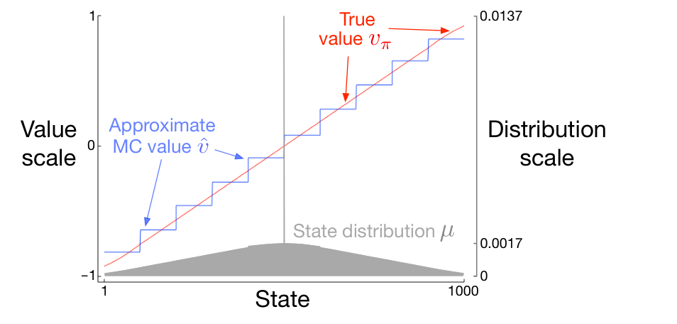

**图 9.1：**在 1000 状态随机游走任务中，使用梯度蒙特卡洛算法（第 202 页）进行状态聚合函数近似。图内文字译注：横轴“State”为状态编号；左纵轴“Value scale”为价值刻度，右纵轴“Distribution scale”为分布刻度。红线“True value \(v_\pi\)”为真实价值；蓝色阶梯线“Approximate MC value \(\hat v\)”为蒙特卡洛近似价值；下方灰色面积“State distribution \(\mu\)”为状态分布。左轴范围为 \(-1\) 到 \(1\)；右轴标出 \(0\)、\(0.0017\)、\(0.0137\)。

参考该任务的状态分布 \(\mu\)，能更清楚地理解近似价值的一些细节。分布画在图的下半部分，使用右侧刻度。位于中央的状态 500 是每个回合的起始状态，但此后很少再次访问。平均来说，约 1.37% 的时间步停留在起始状态。从起始状态一步可达的各状态，访问频率居第二位，每个状态约占 0.17% 的时间步。此后 \(\mu\) 几乎线性下降，在两端的状态 1 和 1000 降至约 0.0147%。这一分布最明显的影响出现在最左端和最右端的组：左端各组的估计价值明显高于组内各状态真实价值的未加权平均值，右端各组的估计价值明显低于未加权平均值。原因是这些区域中的状态在按 \(\mu\) 加权时，不对称程度最大。例如，在最左端的组中，状态 100 的权重是状态 1 的三倍多。因此，这一组的价值估计偏向于状态 100 的真实价值；它高于状态 1 的真实价值。

## 9.4 线性方法

函数近似最重要的一种特殊情况是：近似函数 \(\hat v(\cdot,\mathbf w)\) 对权重向量 \(\mathbf w\) 为线性函数。每个状态 \(s\) 都对应一个实值向量 \(\mathbf x(s)=(x_1(s),x_2(s),\ldots,x_d(s))^\top\)，它与 \(\mathbf w\) 的分量数相同。线性方法用 \(\mathbf w\) 与 \(\mathbf x(s)\) 的内积来近似状态价值函数：
