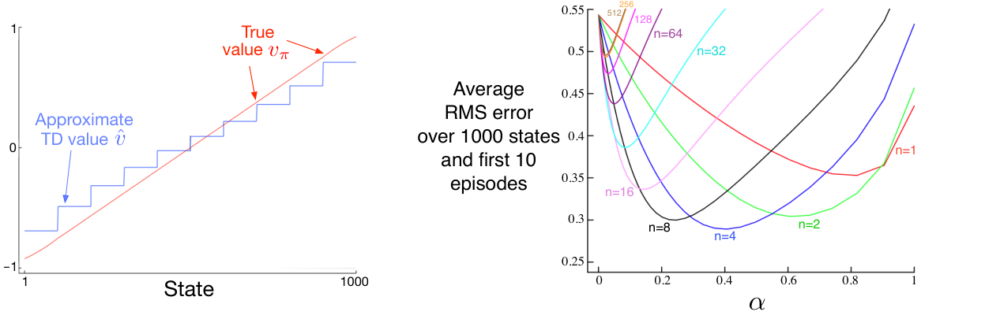

类似于（9.14）的误差界，也适用于其他同策略自举方法。例如，线性半梯度 DP（式（9.7）中 \(U_t\doteq\sum_a\pi(a\mid S_t)\sum_{s',r}p(s',r\mid S_t,a)[r+\gamma\hat v(s',\mathbf w_t)]\)），如果按同策略分布更新，也会收敛到 TD 不动点。下一章介绍的一步半梯度动作价值方法，例如半梯度 Sarsa(0)，会收敛到类似的不动点，并满足类似的误差界。回合式任务有一个稍有不同但相关的误差界（见 Bertsekas 和 Tsitsiklis，1996）。关于奖励、特征和步长参数的递减，还有一些技术条件，这里未列出。完整细节见原论文（Tsitsiklis 和 Van Roy，1997）。

这些收敛结果的关键条件是：按同策略分布更新状态。如果采用其他更新分布，将自举与函数近似结合的方法甚至可能发散到无穷大。第 11 章给出这类例子，并讨论可能的解决方法。

**示例 9.2：在 1000 状态随机游走中使用自举。**状态聚合是线性函数近似的一种特殊情况，因此我们再看 1000 状态随机游走，以说明本章的一些结论。图 9.2 左图显示，半梯度 TD(0) 算法（第 203 页）采用示例 9.1 的状态聚合时学到的最终价值函数。可以看到，接近渐近状态的 TD 近似确实比图 9.1 的蒙特卡洛近似离真实价值更远。

尽管如此，TD 方法仍可能在学习速度上有很大优势，并且是蒙特卡洛方法的推广；第 7 章的 n 步 TD 方法已充分说明这一点。图 9.2 右图展示在 1000 状态随机游走中，以状态聚合使用 n 步半梯度 TD 方法的结果，与先前在 19 状态随机游走中用表格型方法得到的结果（图 7.2）惊人地相似。为了得到数值上如此相似的结果，我们把状态聚合改成每组 50 个状态、共 20 组。这 20 组在数量尺度上便接近表格型任务的 19 个状态。

**图 9.2：**在 1000 状态随机游走任务中使用状态聚合的自举方法。左图：半梯度 TD 的渐近价值比图 9.1 中蒙特卡洛方法的渐近价值更不准确。右图：n 步方法采用状态聚合时的表现，与表格型表示的结果非常相似（参见图 7.2）。数据为 100 次运行的平均。图内文字译注：左图横轴“State”为状态编号；“True value \(v_\pi\)”是真实价值，“Approximate TD value \(\hat v\)”是 TD 近似价值。右图横轴 \(\alpha\) 为步长；纵轴“Average RMS error over 1000 states and first 10 episodes”是对全部 1000 个状态及前 10 个回合计算的平均均方根误差；彩色曲线旁的 \(n=1,2,4,8,16,32,64,128,256,512\) 表示不同的步数。
