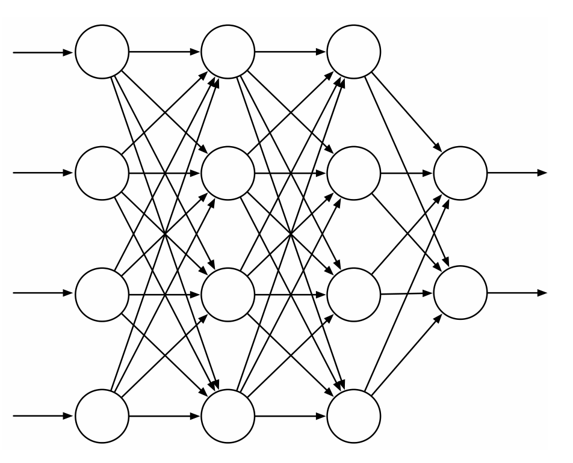

**图 9.14**　含四个输入单元、两个输出单元和两个隐藏层的通用前馈 ANN。

前馈 ANN 和循环 ANN 都已用于强化学习，这里只讨论较简单的前馈情形。

网络中的单元（图 9.14 中的圆圈）通常是半线性单元：它们先计算输入信号的加权和，再对结果应用一个非线性函数，称为*激活函数*，以生成单元的输出，即*激活值*。激活函数有多种，通常是 S 形的 sigmoid 函数，例如逻辑函数 \(f(x)=1/(1+e^{-x})\)；有时也使用整流非线性函数 \(f(x)=\max(0,x)\)。若采用阶跃函数，即 \(x\ge\theta\) 时 \(f(x)=1\)，否则 \(f(x)=0\)，得到的就是阈值为 \(\theta\) 的二值单元。网络输入层的单元略有不同：它们的激活值由外部提供，其值就是网络所近似函数的输入。

前馈 ANN 每个输出单元的激活值，都是网络输入单元激活值组合的非线性函数。网络连接的权重是这些函数的参数。没有隐藏层的 ANN 只能表示所有可能输入输出函数中极小的一部分。不过，只要单个隐藏层包含足够多但数量有限的 sigmoid 单元，ANN 就能以任意精度近似网络输入空间中紧致区域上的任意连续函数（Cybenko，1989）。满足一些宽松条件的其他非线性激活函数也有这个性质，但非线性是必要的：如果多层前馈 ANN 的所有单元都采用线性激活函数，那么整个网络等价于没有隐藏层的网络，因为线性函数的线性组合仍是线性函数。

尽管单隐藏层 ANN 具有这种“通用近似”性质，实践和理论都表明，要近似许多人工智能任务需要的复杂函数，采用由多层低层抽象逐级组合而成的层次结构会更容易，甚至可能是必需的。这样的抽象由多隐藏层 ANN 等深度架构产生。（参见 Bengio，2009 的全面综述。）
