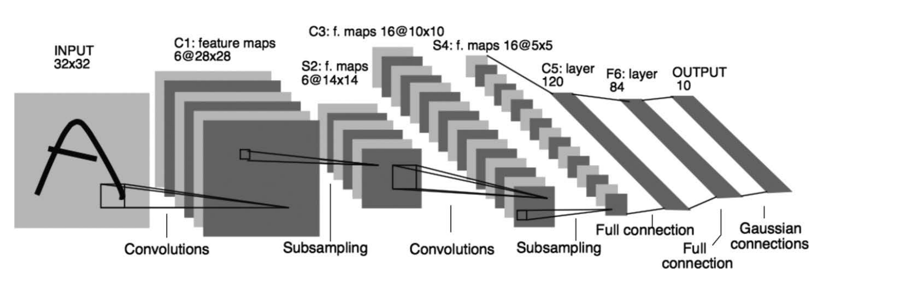

训练深度 ANN 的另一项有用技术是*深度残差学习*（He、Zhang、Ren 和 Sun，2016）。有时，与其直接学习某个函数，不如学习它与恒等函数之间的差异。然后，把这一差异，即残差函数，加到输入上，便得到所需函数。在深度 ANN 中，只需绕过一组层添加*捷径连接*，也称*跳跃连接*，便可让这组层学习残差函数。这些连接把该组层的输入加到输出上，不需要增加权重。He 等人（2016）在深度卷积网络的每对相邻层周围添加跳跃连接来评估此方法，发现它在基准图像分类任务上的表现显著优于没有跳跃连接的网络。第 16 章将介绍的围棋强化学习应用，同时使用了批量归一化和深度残差学习。

*深度卷积网络*是一类深度 ANN，已在各种应用中取得很大成功，其中也包括令人瞩目的强化学习应用（第 16 章）。这种网络专门处理图像等按空间阵列排列的高维数据。它的设计受到大脑早期视觉处理机制的启发（LeCun、Bottou、Bengio 和 Haffner，1998）。由于采用了特殊架构，深度卷积网络可以通过反向传播训练，而不必借助上述方法来训练深层。

图 9.15 展示了深度卷积网络的架构。这个来自 LeCun 等人（1998）的实例用于识别手写字符。它由交替排列的卷积层和下采样层，以及最后几个全连接层组成。每个卷积层产生若干*特征图*。特征图是一个单元阵列上的活动模式；其中每个单元都对自身的*感受野*内的数据执行同一种运算。感受野指这个单元能从前一层“看到”的那部分数据；对于第一个卷积层，则是它能从外部输入中看到的部分。同一特征图中的单元彼此相同，只有感受野在输入数据阵列中的位置不同；这些感受野的大小和形状也都相同。同一特征图中的单元共享权重。这意味着，无论同一特征出现在输入阵列中的什么位置，特征图都能检测到它。

**图 9.15**　深度卷积网络。经 *Proceedings of the IEEE* 授权转载，原载 LeCun、Bottou、Bengio 和 Haffner 于 1998 年在第 86 卷发表的《Gradient-based learning applied to document recognition》；授权经 Copyright Clearance Center, Inc. 转达。

**图内文字译注：**INPUT 32×32：输入，32×32；C1: feature maps 6@28×28：C1，6 张 28×28 特征图；S2: f. maps 6@14×14：S2，6 张 14×14 特征图；C3: f. maps 16@10×10：C3，16 张 10×10 特征图；S4: f. maps 16@5×5：S4，16 张 5×5 特征图；C5: layer 120：C5 层，120 个单元；F6: layer 84：F6 层，84 个单元；OUTPUT 10：输出，10 个单元；Convolutions（两处）：卷积；Subsampling（两处）：下采样；Full connection（两处）：全连接；Gaussian connections：高斯连接。
