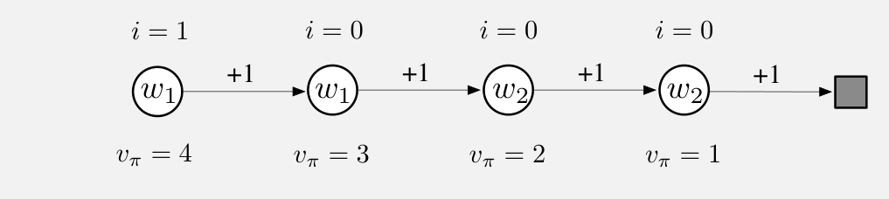

示例 9.4 说明，关注度与强调权重如何让价值估计更准确。

:::source-box

### 示例 9.4：关注度与强调权重

为了看出使用关注度和强调权重的潜在好处，考虑下面的四状态马尔可夫奖励过程：

图内文字译注：从左到右四个圆表示四个状态，箭头均指向右侧状态；每次转移的奖励都是 \(+1\)，最后进入灰色终止状态。每个圆上方的 \(i\) 表示关注度，第一状态为 \(1\)，其余三个为 \(0\)。圆内的 \(w_1,w_1,w_2,w_2\) 表示由权重给出的估计价值；下方 \(v_\pi=4,3,2,1\) 是各状态的真实价值。

每个回合从最左边的状态开始，然后每一步向右转移一个状态，并获得 \(+1\) 奖励，直到终止状态。因此，第一状态的真实价值为 4，第二状态为 3，后续各状态如图所示。这些是真实价值；由于参数化方式的限制，估计价值只能近似它们。参数向量 \(\mathbf w=(w_1,w_2)^\top\) 有两个分量；图中每个状态圆内标出了它使用的参数。前两个状态的估计价值都只由 \(w_1\) 给出，因此虽然真实价值不同，它们的估计价值必须相同。后两个状态同样都只由 \(w_2\) 给出，也必须具有相同的估计价值。假设我们只希望准确评估最左边的状态：给它指定关注度 1，其他状态都指定关注度 0，如图所示。

先考虑对这个任务应用梯度蒙特卡洛算法。本章前面给出的不考虑关注度和强调权重的算法（式（9.7）及第 202 页的方框），在步长逐渐减小时会收敛到参数向量 \(\mathbf w_\infty=(3.5,1.5)\)。这样，第一状态——我们唯一关注的状态——得到的价值估计是 3.5，介于第一、第二状态的真实价值之间。另一方面，本节使用关注度和强调权重的方法，会完全正确地学到第一状态的价值；\(w_1\) 收敛到 4，而 \(w_2\) 不会更新，因为除最左边状态外，所有状态的强调权重都是零。

现在考虑应用两步半梯度 TD 方法。本章前面不使用关注度和强调权重的方法（式（9.15）、（9.16）），同样会收敛到 \(\mathbf w_\infty=(3.5,1.5)\)；而使用关注度和强调权重的方法会收敛到 \(\mathbf w_\infty=(4,2)\)。后者对第一状态和第三状态给出完全正确的价值（第一状态的自举目标来自第三状态），同时从不执行对应第二或第四状态的更新。

:::end-source-box
