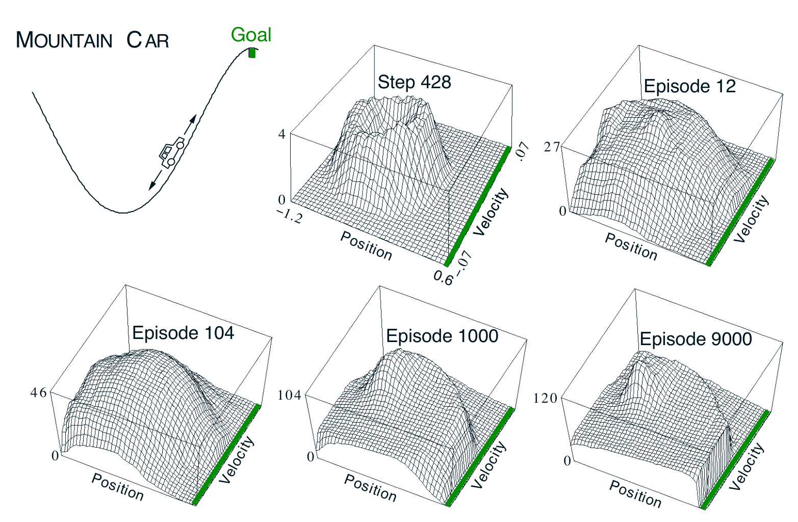

**图 10.1**　山地车任务（左上图），以及一次运行中学习到的到达目标成本函数 \(-\max_a\hat q(s,a,\mathbf w)\)。

**图内文字译注：**MOUNTAIN CAR：山地车；Goal：目标；Position：位置；Velocity：速度；Step 428：第 428 步；Episode 12、104、1000、9000：第 12、104、1000、9000 个回合。曲面边缘的绿色线对应目标位置；坐标轴上的数字与正负号按原图保留。

这是一个简单的连续状态控制任务：从某种意义上讲，情况必须先变差（离目标更远），才能变好。许多控制方法如果没有人为设计者明确提供帮助，就很难处理这类任务。

在这个问题中，汽车越过山顶的目标位置之前，每个时间步的奖励都是 \(-1\)；越过目标位置时回合结束。可选行动有三种：向前全油门（\(+1\)）、向后全油门（\(-1\)），以及不踩油门（\(0\)）。汽车遵循简化的物理规律运动。其位置 \(x_t\) 与速度 \(\dot x_t\) 更新为

$$
x_{t+1}\doteq\operatorname{bound}\bigl[x_t+\dot x_{t+1}\bigr],
$$

$$
\dot x_{t+1}\doteq\operatorname{bound}
\bigl[\dot x_t+0.001A_t-0.0025\cos(3x_t)\bigr].
$$

其中，\(\operatorname{bound}\) 操作保证 \(-1.2\le x_{t+1}\le0.5\) 且 \(-0.07\le\dot x_{t+1}\le0.07\)。此外，当 \(x_{t+1}\) 到达左边界时，\(\dot x_{t+1}\) 重置为零；到达右边界时，即到达目标，回合终止。每个回合从随机位置 \(x_t\in[-0.6,-0.4)\) 和零速度开始。为了把这两个连续状态变量转换为二值特征，我们采用图 9.9 所示的网格铺砌：共用 8 个铺砌，每块瓦片在各维覆盖有界区间长度的八分之一，并采用 9.5.4 节介绍的非对称偏移。¹
