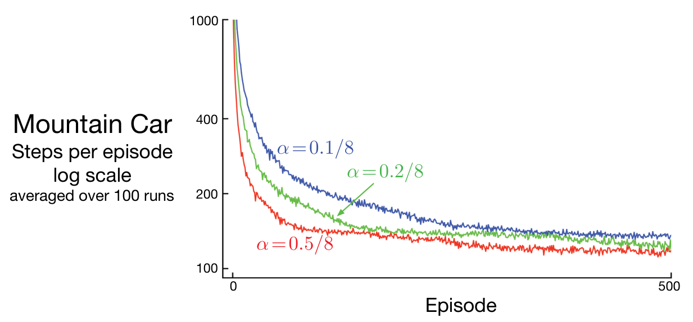

瓦片编码生成的特征向量 \(\mathbf x(s,a)\) 再与参数向量作线性组合，以近似动作价值函数：

$$
\hat q(s,a,\mathbf w)\doteq\mathbf w^\top\mathbf x(s,a)
=\sum_{i=1}^{d}w_i\,x_i(s,a),
\tag{10.3}
$$

这适用于每个状态 \(s\) 与行动 \(a\) 组成的配对。

图 10.1 展示了使用这种函数近似形式学习解决山地车任务时通常发生的情况。² 图中是单次运行学得的价值函数的相反数，即*到达目标的成本函数*（cost-to-go function）。动作价值的初值全为零；这是一种乐观初始化，因为本任务中的真实价值全为负。因此，即使探索参数 \(\epsilon=0\)，仍会发生大量探索。图中上排中间标为“第 428 步”的面板展示了这一点：当时连一个回合都尚未完成，但汽车已经在山谷里来回摆动，在状态空间中形成环形轨迹。频繁访问过的状态，其估计价值都低于尚未探索的状态，因为实际得到的奖励比原先不切实际的预期更差。这不断促使智能体离开走过的位置，探索新状态，直到找到解决办法。

图 10.2 给出了这个问题上半梯度 Sarsa 在不同步长下的几条学习曲线。

**图 10.2**　山地车任务的学习曲线：采用瓦片编码函数近似及 \(\epsilon\)-贪心行动选择的半梯度 Sarsa 方法。

**图内文字译注：**Mountain Car：山地车；Steps per episode：每回合步数；log scale：对数尺度；averaged over 100 runs：100 次运行的平均值；Episode：回合；蓝线 \(\alpha=0.1/8\)，绿线 \(\alpha=0.2/8\)，红线 \(\alpha=0.5/8\)。

脚注 1：具体来说，我们使用瓦片编码软件，见 http://incompleteideas.net/tiles/tiles3.html。令 `iht=IHT(4096)`，并调用 `tiles(iht,8,[8*x/(0.5+1.2),8*xdot/(0.07+0.07)],[A])`，得到状态 \((x,\dot x)\) 和行动 \(A\) 对应的特征向量中取值为 1 的分量索引。

脚注 2：这组数据实际上来自第 12 章才会介绍的“半梯度 Sarsa(\(\lambda\))”算法，但半梯度 Sarsa 的表现会相近。
