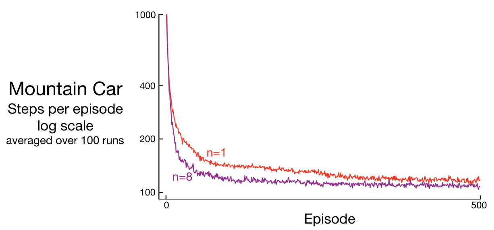
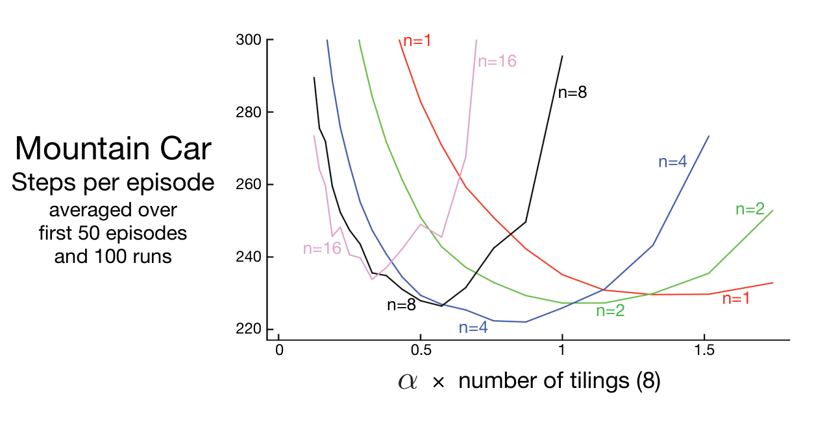

**图 10.3**　山地车任务中一步与八步半梯度 Sarsa 的表现对比。所用步长较合适：\(n=1\) 时 \(\alpha=0.5/8\)，\(n=8\) 时 \(\alpha=0.3/8\)。

**图内文字译注：**Mountain Car：山地车；Steps per episode：每回合步数；log scale：对数尺度；averaged over 100 runs：100 次运行的平均值；Episode：回合；红线 \(n=1\)，紫线 \(n=8\)。

**图 10.4**　山地车任务中，采用瓦片编码函数近似的半梯度 \(n\) 步 Sarsa，其早期表现受 \(\alpha\) 和 \(n\) 的影响。与通常情况一样，中等程度的自举（\(n=4\)）表现最好。这些结果是在按对数尺度选定的若干 \(\alpha\) 值处测得，再用直线连接。标准误差从 \(n=1\) 时的 \(0.5\)（小于线宽）到 \(n=16\) 时的约 \(4\)，因此所有主要效应在统计上都显著。

**图内文字译注：**Mountain Car：山地车；Steps per episode：每回合步数；averaged over first 50 episodes and 100 runs：前 50 个回合、100 次运行的平均值；横轴 \(\alpha\times\text{number of tilings (8)}\)：\(\alpha\) 乘以铺砌数（8）；红、绿、蓝、黑、粉色曲线分别为 \(n=1,2,4,8,16\)，同一条曲线在两端可能重复标注。

**习题 10.1**　本章没有明确讨论任何蒙特卡洛方法，也没有给出它们的伪代码。这些方法会是什么样？为什么不给出伪代码是合理的？它们在山地车任务上会表现如何？ □

**习题 10.2**　请给出用于控制的半梯度一步期望 Sarsa（Expected Sarsa）伪代码。 □

**习题 10.3**　为什么图 10.4 中，当 \(n\) 较大时，结果的标准误差比 \(n\) 较小时更高？ □
