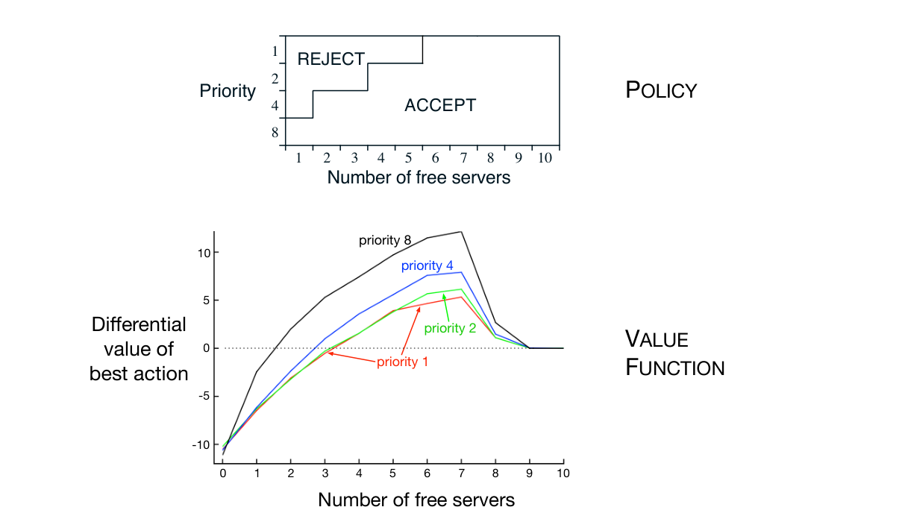

**示例 10.2：访问控制排队任务**　这个决策任务控制对一组 10 台服务器的访问。四种不同优先级的客户来到同一个队列。若客户获准使用服务器，则根据其优先级向服务器支付 \(1\)、\(2\)、\(4\) 或 \(8\) 的奖励；优先级越高，支付越多。在每个时间步，队首客户或者被接纳（分配到一台服务器），或者被拒绝（从队列移除，奖励为零）。无论如何，下一个时间步都考虑队列中的下一位客户。队列永远不会为空，队列中客户的优先级均匀随机分布。当然，如果没有空闲服务器，就无法服务客户，此时必然拒绝该客户。每台忙碌的服务器在每个时间步以 \(p=0.06\) 的概率恢复空闲。我们刚才描述了到达和离开的统计规律，以便明确任务；但现在假设这些统计规律未知。目标是在每一步根据客户的优先级和空闲服务器的数量，决定接纳还是拒绝下一位客户，从而在不使用折扣的情况下最大化长期奖励。

在这个示例中，我们考虑该问题的一个表格型解。虽然不同状态之间没有泛化，仍可把它放在函数近似的一般设定中讨论，因为这一设定包含了表格型设定。因此，对于每个“状态（空闲服务器数量与队首客户优先级）—行动（接纳或拒绝）”对，都有一个差分动作价值估计。图 10.5 显示使用差分半梯度 Sarsa 得到的解，参数为 \(\alpha=0.01\)、\(\beta=0.01\) 和 \(\epsilon=0.1\)。初始动作价值及 \(\bar R\) 都设为零。

**图 10.5：**差分半梯度单步 Sarsa 在访问控制排队任务上运行 200 万步后得到的策略与价值函数。图右侧曲线的下降可能由数据不足造成；其中许多状态从未出现过。学到的 \(\bar R\) 约为 \(2.31\)。（这里的优先级 \(1\) 是最低优先级。）图内文字译注：上图“POLICY”是“策略”，纵轴“Priority”是“优先级”，横轴“Number of free servers”是“空闲服务器数量”；“REJECT”与“ACCEPT”分别为“拒绝”和“接纳”。下图“VALUE FUNCTION”是“价值函数”，纵轴“Differential value of best action”是“最优行动的差分价值”，横轴同为“空闲服务器数量”；黑、蓝、绿、红曲线分别表示优先级 \(8\)、\(4\)、\(2\)、\(1\)。
