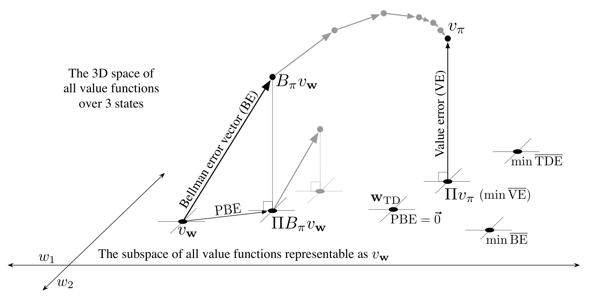

**图 11.3**　线性价值函数近似的几何结构。图中展示了三个状态上的所有价值函数所构成的三维空间；其中的平面，是参数为 \(\mathbf w=(w_1,w_2)^\top\) 的线性函数近似器能够表示的价值函数子空间。真实价值函数 \(v_\pi\) 位于更大的空间中，可以通过投影算子 \(\Pi\) 投影到该子空间，在价值误差（VE）意义下得到其最佳近似。按贝尔曼误差（BE）、投影贝尔曼误差（PBE）和时序差分误差（TDE）衡量的最佳近似器，可能各不相同，图中右下方展示了它们。（图中把 VE、BE 和 PBE 都视为相应的向量。）贝尔曼算子把平面内的价值函数映射到平面外，随后可以将结果投影回来。如果像传统动态规划那样，不断在子空间外应用贝尔曼算子（上方的灰色路径），最终会到达真实价值函数。如果改为每一步都投影回子空间（下方的灰色步骤），那么不动点就是 PBE 向量为零的点。

**图内文字译注：**The 3D space of all value functions over 3 states：三个状态上所有价值函数构成的三维空间；The subspace of all value functions representable as \(v_{\mathbf w}\)：能表示为 \(v_{\mathbf w}\) 的所有价值函数构成的子空间；Bellman error vector (BE)：贝尔曼误差向量；Value error (VE)：价值误差；PBE：投影贝尔曼误差；\(w_1,w_2\)：两个权重坐标；\(v_{\mathbf w}\)：当前可表示价值函数；\(B_\pi v_{\mathbf w}\)：施加贝尔曼算子后的价值函数；\(\Pi B_\pi v_{\mathbf w}\)：其投影；\(v_\pi\)：真实价值函数；\(\Pi v_\pi\)（min VE）：真实价值函数的投影（最小价值误差）；\(\mathbf w_{\mathrm{TD}}\)、PBE \(=\vec 0\)：TD 不动点，投影贝尔曼误差向量为零；min BE、min TDE：分别为贝尔曼误差、时序差分误差的最小点。

$$
\Pi v\doteq v_{\mathbf w},
\qquad
\mathbf w=\underset{\mathbf w\in\mathbb R^d}{\arg\min}
\lVert v-v_{\mathbf w}\rVert_\mu^2.
\tag{11.12}
$$

因此，最接近真实价值函数 \(v_\pi\) 的可表示价值函数，是它的投影 \(\Pi v_\pi\)，如图 11.3 所示。蒙特卡洛方法渐近地找到的正是这个解，尽管过程通常很慢。下一页的方框将更详细地讨论投影操作。

TD 方法得到不同的解。为理解其依据，回想价值函数 \(v_\pi\) 的贝尔曼方程：

$$
v_\pi(s)=\sum_a\pi(a\mid s)\sum_{s',r}
p(s',r\mid s,a)\bigl[r+\gamma v_\pi(s')\bigr],
\qquad \text{对所有 }s\in\mathcal S.
\tag{11.16}
$$
