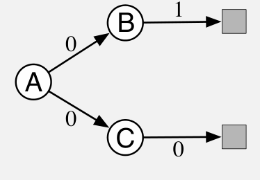

:::source-box

### 示例 11.2：A 分叉——展示朴素残差梯度算法为何朴素

考虑右图所示的三状态回合式马尔可夫奖励过程（MRP）。

**图内文字译注：**A、B、C 是三个状态；灰色方块为终止状态；箭头旁的数字 \(0,1\) 是相应转移的奖励。A 到 B 和 A 到 C 的转移各以 \(1/2\) 的概率发生。

每个回合从状态 A 开始，随后随机“分叉”：一半的情形转移到 B，再必然转移到终止状态并获得奖励 1；另一半转移到 C，再必然转移到终止状态并获得奖励 0。无论走哪条路径，从 A 发出的第一次转移的奖励始终为零。这是回合式问题，可以取 \(\gamma=1\)。我们还假设同策略训练，因此 \(\rho_t\) 始终为 1，并采用表格型函数近似，使学习算法可以独立、任意地为三个状态赋值。因此，这本应是一个容易的问题。

这些状态应该具有怎样的价值？从 A 出发，一半的回合回报为 1，另一半为 0，所以 A 的价值应为 \(1/2\)。从 B 出发回报总是 1，因此 B 的价值应为 1；从 C 出发回报总是 0，因此 C 的价值应为 0。这些就是真实价值；由于是表格型问题，前面介绍的所有方法都会精确收敛到它们。

然而，朴素残差梯度算法为 B 和 C 找到了不同的价值：B 收敛到 \(3/4\)，C 收敛到 \(1/4\)（A 正确地收敛到 \(1/2\)）。事实上，这组价值使 \(\overline{\mathrm{TDE}}\) 最小。

来计算这组价值的 \(\overline{\mathrm{TDE}}\)。每个回合的第一次转移，要么从价值 \(1/2\) 的 A 向上到达价值 \(3/4\) 的 B，变化 \(1/4\)；要么向下到达价值 \(1/4\) 的 C，变化 \(-1/4\)。这些转移的奖励为零，且 \(\gamma=1\)，所以这些变化就是 TD 误差；第一次转移上的 TD 误差平方始终为 \(1/16\)。第二次转移也类似：要么从价值 \(3/4\) 的 B，得到奖励 1 后到达价值 0 的终止状态；要么从价值 \(1/4\) 的 C，得到奖励 0 后到达价值 0 的终止状态。因此，第二步的 TD 误差总为 \(\pm1/4\)，平方也为 \(1/16\)。所以，对这组价值，两步的 \(\overline{\mathrm{TDE}}\) 都是 \(1/16\)。

再计算真实价值（B 为 1，C 为 0，A 为 \(1/2\)）下的 \(\overline{\mathrm{TDE}}\)。第一次转移要么从 \(1/2\) 上升到 B 的 1，要么从 \(1/2\) 下降到 C 的 0；两种情况下误差的绝对值都是 \(1/2\)，平方为 \(1/4\)。第二次转移的误差为零，因为起始状态的价值——从 B 转移时为 1，从 C 转移时为 0——总与即时奖励及回报完全吻合。因此，两次转移的 TD 误差平方分别是 \(1/4\) 和 0，平均 TD 误差平方为 \(1/8\)。（译注：原文此处作“mean reward”；由前后计算可知，应指平均 TD 误差平方。）由于 \(1/8>1/16\)，按 \(\overline{\mathrm{TDE}}\) 衡量，真实价值反而更差。即使在这个简单问题上，真实价值也不具有最小的 \(\overline{\mathrm{TDE}}\)。

:::end-source-box
