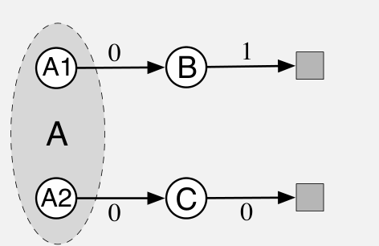

然而，残差梯度方法的收敛仍至少在三个方面不令人满意。第一，经验表明它很慢，比半梯度方法慢得多。事实上，该方法的支持者提出：起初结合速度更快的半梯度方法来加速，随后逐渐转向残差梯度，以获得收敛保证（Baird 和 Moore，1999）。第二，它似乎仍会收敛到错误的价值。在所有表格型情形中，例如 A 分叉示例，它确实能得到正确价值，因为此时贝尔曼方程可以精确求解。然而，若考察真正使用函数近似的示例，残差梯度算法，甚至 \(\overline{\mathrm{BE}}\) 这个目标本身，似乎都会找到错误的价值函数。一个特别能说明问题的例子，是上一页介绍的 A 预分叉示例，它是 A 分叉示例的变体；残差梯度算法在其中找到与其朴素版本相同的糟糕解。这个例子直观地表明，最小化 \(\overline{\mathrm{BE}}\)（残差梯度算法确实能做到这一点）未必是理想目标。

:::source-box

### 示例 11.3：A 预分叉——贝尔曼误差目标的反例

考虑右图所示的回合式 MRP。每个回合以相同概率从 A1 或 A2 开始。

**图内文字译注：**A1、A2 是两个不同的起始状态，但在函数近似器看来同为 A；B、C 是另外两个不同状态；灰色方块为终止状态；箭头上的 \(0,1\) 表示相应转移的奖励。

这两个状态在函数近似器看来完全相同，就像单个状态 A；它们的特征表示与另外两个状态 B、C 的特征表示不同且无关，而 B 与 C 的特征表示也彼此不同。具体地，函数近似器的参数有三个分量：一个给出 B 的价值，一个给出 C 的价值，另一个同时给出 A1 和 A2 的价值。除初始状态的选择外，系统都是确定性的。从 A1 开始时，系统以奖励 0 转移到 B，随后以奖励 1 转移到终止状态；从 A2 开始时，系统转移到 C，再转移到终止状态，两次奖励都为零。

对于只能看到特征的学习算法，这个系统与 A 分叉示例毫无区别：它看起来总从 A 开始，再以相同概率到达 B 或 C，最后根据前一状态确定性地以奖励 1 或 0 终止。与 A 分叉示例相同，B 和 C 的真实价值分别为 1 和 0；出于对称性，A1 和 A2 共用的最佳价值为 \(1/2\)。

因为从外部看，这个问题与 A 分叉示例相同，我们已经知道各算法会找到什么价值。半梯度 TD 收敛到刚才提到的理想价值；朴素残差梯度算法则分别使 B、C 收敛到 \(3/4\) 和 \(1/4\)。所有状态转移都是确定性的，所以非朴素的残差梯度算法也会收敛到这些价值（在这里它与朴素算法相同）。由此，这个“朴素”解也一定是最小化 \(\overline{\mathrm{BE}}\) 的解；事实确实如此。在确定性问题中，贝尔曼误差与 TD 误差完全相同，因此 \(\overline{\mathrm{BE}}\) 总与 \(\overline{\mathrm{TDE}}\) 相同。对这个示例优化 \(\overline{\mathrm{BE}}\)，会产生与朴素残差梯度算法在 A 分叉示例中相同的失败模式。

:::end-source-box
