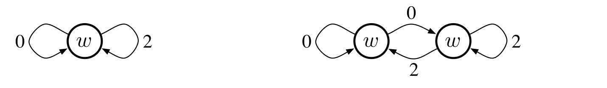

残差梯度算法的收敛在第三个方面为何不令人满意，下一节将作解释。与第二个方面一样，这个问题也出在 \(\overline{\mathrm{BE}}\) 目标本身，而不在于实现该目标的某个特定算法。

## 11.6　贝尔曼误差不可学习

本节所说的*可学习性*，不同于机器学习中常用的含义。在后者那里，说一个假设“可学习”，通常是说它能够*高效地*学得，即所需样本数随问题规模按多项式增长，而非指数增长。这里的含义更基础：不论有多少经验，到底能不能学得。事实表明，强化学习中许多看似有价值的量，即使拥有无限多的经验数据，也无法学得。只要知道环境的内部结构，这些量都有明确定义并可计算；但仅凭观察到的特征向量、行动和奖励序列，既不能计算也不能估计它们。² 我们称这些量*不可学习*。前两节介绍的贝尔曼误差目标 \(\overline{\mathrm{BE}}\)，在这个意义下就是不可学习的。无法从可观测数据中学得这一目标，可能是最有力的理由，说明我们不应追求它。

为了说明可学习性的含义，先看一些简单例子。考虑下图所示的两个马尔可夫奖励过程³（MRP）：

**图内文字译注：**左图只有一个状态，右图有两个状态；所有状态都产生同一特征 \(x=1\)，因而近似价值都标为 \(w\)。箭头旁的 \(0\) 和 \(2\) 是转移奖励。左图在同一状态中随机得到 0 或 2；右图在两个状态之间停留或切换，两个状态的奖励分别固定为 0 和 2。

若一个状态有两条出边，就假定两个转移以相同概率发生；数字表示所得奖励。所有状态在观察中看起来都一样：它们产生同一个单分量特征向量 \(x=1\)，近似价值也都为 \(w\)。因此，数据轨迹中唯一变化的是奖励序列。左侧 MRP 始终停留在同一状态，随机地产生无限长的 0 和 2 序列，两者概率各为 0.5。右侧 MRP 每一步以相同概率留在当前状态或切换到另一个状态。在右侧 MRP 中，奖励是确定性的：从一个状态出发总得 0，从另一个状态出发总得 2。但由于每一步两个状态的出现概率相同，可观测数据仍是随机出现 0 和 2 的无限序列，与左侧 MRP 产生的数据完全相同。（可以假定右侧 MRP 一开始以相同概率随机选择两个状态之一。）因此，即使数据量无限，也无法判断究竟是哪个 MRP 产生了数据。尤其无法判断这个 MRP 有一个状态还是两个状态，转移是随机的还是确定性的。这些都不可学习。

脚注 2：当然，如果能够观察到状态序列，而不只是对应的特征向量，这些量就可以估计。

脚注 3：所有 MRP 都可以看作每个状态只有一种行动的 MDP；这里对 MRP 得出的结论也适用于 MDP。
