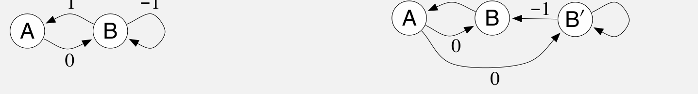

:::source-box

### 示例 11.4：贝尔曼误差可学习性的反例

要展示全部可能性，需要一对比前面稍复杂的马尔可夫奖励过程（MRP）。考虑下图的两个 MRP：

**图内文字译注：**左侧 MRP 的状态是 A、B；右侧 MRP 的状态是 A、B、B′，其中 B 和 B′ 在函数近似器看来相同。箭头旁的 \(1,0,-1\) 为相应转移奖励；各有两条出边的状态，其两条转移各以 \(1/2\) 的概率发生。

如果一个状态有两条出边，就假定两个转移的概率相同；数字表示所得奖励。左侧 MRP 有两个状态，它们的表示彼此不同。右侧 MRP 有三个状态，其中 B 和 B′ 看起来相同，必须赋予相同的近似价值。具体地，\(\mathbf w\) 有两个分量：第一个给出状态 A 的价值，第二个同时给出 B 与 B′ 的价值。第二个 MRP 被设计为三个状态各占相同的时间比例，因此可对所有 \(s\) 取 \(\mu(s)=1/3\)。

注意，这两个 MRP 的可观测数据分布相同。两种情形下，智能体都会看到一次 A，随后得到 0；再看到若干次表面上的 B，每次之后都得到 \(-1\)，只有最后一次之后得到 1；然后又从一次 A 和奖励 0 重新开始，如此循环。所有统计细节也相同：在两个 MRP 中，一串长度为 \(k\) 的 B 出现的概率都是 \(2^{-k}\)。

现在假设 \(\mathbf w=\mathbf 0\)。对第一个 MRP，这是一个精确解，\(\overline{\mathrm{BE}}=0\)。对第二个 MRP，这个解在 B 和 B′ 中都产生大小为 1 的平方误差，因此 \(\overline{\mathrm{BE}}=\mu(B)\cdot1+\mu(B')\cdot1=2/3\)。两个 MRP 产生相同的数据分布，\(\overline{\mathrm{BE}}\) 却不同；所以 \(\overline{\mathrm{BE}}\) 不可学习。

而且，与前面讨论 \(\overline{\mathrm{VE}}\) 的示例不同，两个 MRP 使 \(\overline{\mathrm{BE}}\) 最小的 \(\mathbf w\) 也不同。对第一个 MRP，任何 \(\gamma\) 下 \(\mathbf w=\mathbf 0\) 都使 \(\overline{\mathrm{BE}}\) 最小。对第二个 MRP，最优 \(\mathbf w\) 是 \(\gamma\) 的一个复杂函数；但当 \(\gamma\to1\) 时，它趋于 \((-1/2,0)^\top\)。因此，仅凭数据不能估计使 \(\overline{\mathrm{BE}}\) 最小的解；还需要知道 MRP 中未被数据揭示的结构。在这个意义下，原则上不可能把 \(\overline{\mathrm{BE}}\) 作为学习目标来追求。

第二个 MRP 中使 \(\overline{\mathrm{BE}}\) 最小的 A 的价值远低于零，这也许令人意外。回想 A 有专属权重，其价值并不受函数近似的限制。从 A 出发先获得奖励 0，再转移到价值接近 0 的状态，这似乎意味着 \(v_{\mathbf w}(A)\) 应为 0；为什么最优值却明显为负？原因是，把 \(v_{\mathbf w}(A)\) 设为负值，能减小从 B 到达 A 时的误差。这条确定性转移的奖励为 1，意味着 B 的价值应比 A 高 1。由于 B 的价值约为零，A 的价值便被推向 \(-1\)。使 \(\overline{\mathrm{BE}}\) 最小的 A 的价值约为 \(-1/2\)，是在减少离开 A 和进入 A 时的误差之间取得的折中。

:::end-source-box
