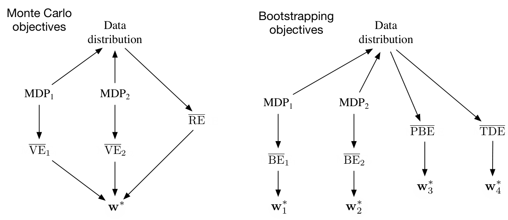

**图 11.4：**数据分布、MDP 和各种目标之间的因果关系。**左侧，蒙特卡洛目标：**两个不同的 MDP 可以产生相同的数据分布，却产生不同的 \(\overline{\mathrm{VE}}\)；这证明 VE 目标无法由数据确定，因而不可从数据中学习。然而，所有这些 VE 必须具有相同的最优参数向量 \(\mathbf w^*\)！而且，同一个 \(\mathbf w^*\) 也能由另一个目标 \(\overline{\mathrm{RE}}\) 确定；RE 由数据分布唯一确定。因此，即使 VE 不可学习，\(\mathbf w^*\) 和 RE 仍可学习。**右侧，自举目标：**两个不同的 MDP 可以产生相同的数据分布，却产生不同的 \(\overline{\mathrm{BE}}\)，且各自有不同的最小化参数向量；因此，无法从数据分布学习它们。\(\overline{\mathrm{PBE}}\) 与 \(\overline{\mathrm{TDE}}\) 目标以及它们（不同的）最小值，则可以直接由数据确定，所以可学习。图内文字译注：“Monte Carlo objectives”为“蒙特卡洛目标”，“Bootstrapping objectives”为“自举目标”，“Data distribution”为“数据分布”；\(\mathrm{MDP}_1\)、\(\mathrm{MDP}_2\) 表示两个不同的过程；箭头表示上游对象决定下游对象。图中带上横线的 VE、RE、BE、PBE、TDE 分别对应书中的五类平均误差目标；\(\mathbf w_i^*\) 表示各目标的最优参数向量。

因此，\(\overline{\mathrm{BE}}\) 不可学习：无法根据特征向量和其他可观测数据估计它。这把 \(\overline{\mathrm{BE}}\) 的使用限制在基于模型的设定中。如果不能访问特征向量背后的底层 MDP 状态，就不存在能最小化 \(\overline{\mathrm{BE}}\) 的算法。残差梯度算法之所以能最小化 \(\overline{\mathrm{BE}}\)，只是因为它允许从**同一个状态**进行双重采样——不是从具有相同特征向量的某个状态采样，而是确保两次采样都来自同一底层状态。不存在绕过这一点的办法。最小化 \(\overline{\mathrm{BE}}\) 必须以某种方式访问那个名义上的底层 MDP。这是 \(\overline{\mathrm{BE}}\) 的重要局限，超出了第 273 页 A-presplit 例子所指出的问题。因此，我们更应关注 \(\overline{\mathrm{PBE}}\)。
