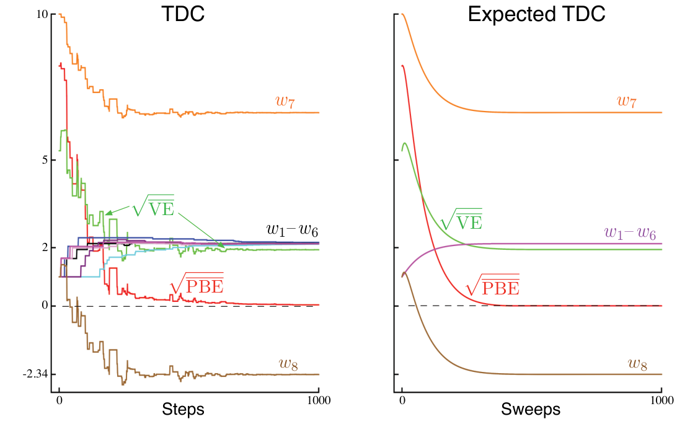

这个算法称为 **GTD2**。注意，只要先计算最后的内积 \(\mathbf x_t^\top\mathbf v_t\)，整个算法的复杂度就是 \(O(d)\)。

在代入 \(\mathbf v_t\) 之前再进行几步代数变换，可以推导出一个稍好的算法。从式（11.29）继续：

\[
\begin{aligned}
\mathbf w_{t+1}
&=\mathbf w_t+\alpha\mathbb E[\rho_t(\mathbf x_t-\gamma\mathbf x_{t+1})\mathbf x_t^\top]\mathbb E[\mathbf x_t\mathbf x_t^\top]^{-1}\mathbb E[\rho_t\delta_t\mathbf x_t]\\
&=\mathbf w_t+\alpha\bigl(\mathbb E[\rho_t\mathbf x_t\mathbf x_t^\top]-\gamma\mathbb E[\rho_t\mathbf x_{t+1}\mathbf x_t^\top]\bigr)\mathbb E[\mathbf x_t\mathbf x_t^\top]^{-1}\mathbb E[\rho_t\delta_t\mathbf x_t]\\
&=\mathbf w_t+\alpha\bigl(\mathbb E[\mathbf x_t\mathbf x_t^\top]-\gamma\mathbb E[\rho_t\mathbf x_{t+1}\mathbf x_t^\top]\bigr)\mathbb E[\mathbf x_t\mathbf x_t^\top]^{-1}\mathbb E[\rho_t\delta_t\mathbf x_t]\\
&=\mathbf w_t+\alpha\bigl(\mathbb E[\rho_t\delta_t\mathbf x_t]-\gamma\mathbb E[\rho_t\mathbf x_{t+1}\mathbf x_t^\top]\mathbb E[\mathbf x_t\mathbf x_t^\top]^{-1}\mathbb E[\rho_t\delta_t\mathbf x_t]\bigr)\\
&\approx\mathbf w_t+\alpha\bigl(\mathbb E[\rho_t\delta_t\mathbf x_t]-\gamma\mathbb E[\rho_t\mathbf x_{t+1}\mathbf x_t^\top]\mathbf v_t\bigr)\\
&\approx\mathbf w_t+\alpha\rho_t\bigl(\delta_t\mathbf x_t-\gamma\mathbf x_{t+1}\mathbf x_t^\top\mathbf v_t\bigr).
\end{aligned}
\]

倒数第二行使用式（11.28），最后一行进行采样。只要先计算最后的内积 \(\mathbf x_t^\top\mathbf v_t\)，其复杂度仍为 \(O(d)\)。这个算法称为**带梯度修正的 TD(0)**（TD(0) with gradient correction，TDC），也称 **GTD(0)**。

图 11.5 展示了 TDC 在 Baird 反例中的一次样本运行及其期望表现。正如预期，\(\overline{\mathrm{PBE}}\) 降至零；但参数向量的各个分量并未趋近于零。事实上，这些值离最优解还很远。最优解要求对所有 \(s\) 都有 \(\hat v(s)=0\)，此时 \(\mathbf w\) 必须与 \((1,1,1,1,1,1,4,2)^\top\) 成比例。经过 1000 次迭代，系统仍远未达到最优解；\(\overline{\mathrm{VE}}\) 仍接近 \(2\)，可见一斑。系统实际上正在收敛到最优解，但由于 \(\overline{\mathrm{PBE}}\) 已经非常接近零，进展极其缓慢。

**图 11.5：**TDC 算法在 Baird 反例中的表现。左图是一次典型的单次运行；右图是同步更新时的期望表现（类似式（11.9），但需为 TDC 的两个参数向量同时更新）。步长为 \(\alpha=0.005\)、\(\beta=0.05\)。图内文字译注：左图标题“TDC”，横轴“Steps”为“步数”；右图标题“Expected TDC”为“期望 TDC”，横轴“Sweeps”为“扫描轮次”。曲线标记 \(w_7\)、\(w_1-w_6\)、\(w_8\) 分别表示参数分量；\(\sqrt{\overline{\mathrm{VE}}}\) 和 \(\sqrt{\overline{\mathrm{PBE}}}\) 分别为价值误差和投影贝尔曼误差的平方根。两图纵轴均保留原书刻度，包括 \(-2.34\)。
