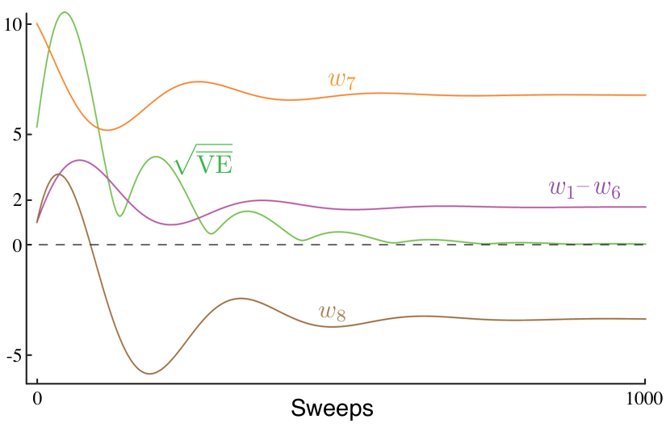

**图 11.6：**单步强调 TD 算法在 Baird 反例中的期望表现。步长为 \(\alpha=0.03\)。图内文字译注：横轴“Sweeps”为“扫描轮次”；橙、紫、棕曲线分别标为 \(w_7\)、\(w_1-w_6\)、\(w_8\)；绿色 \(\sqrt{\overline{\mathrm{VE}}}\) 曲线表示价值误差的平方根。虚线为零，原图纵轴刻度为 \(-5,0,2,5,10\)。

## 11.9 降低方差

异策略学习的方差本来就比同策略学习大。这并不奇怪：如果得到的数据与某个策略的关系较弱，能从中学到的该策略价值信息自然较少。在极端情形下，可能什么也学不到。例如，不能指望通过做晚饭学会开车。只有目标策略与行为策略相关、访问相似的状态并采取相似的行动时，异策略训练才可能取得显著进展。

另一方面，任何策略都有许多相近的策略：它们访问的状态和选择的行动有大量重叠，却并不完全相同。异策略学习存在的理由，就是把学习泛化到数量庞大的这类相关但不相同的策略。剩下的问题是怎样充分利用经验。现在已有一些在期望意义下稳定的方法（前提是步长设置正确），注意力自然转向如何降低估计的方差。可能的办法有很多，本书作为导论只能略举几种。

为什么控制方差对基于重要性采样的异策略方法尤其关键？如前所见，重要性采样经常涉及多个策略比值的乘积。比值的期望始终为一（式（5.13）），但其实际值可能很大，也可能低至零。相继的比值互不相关，因此它们的乘积期望也始终为一，但方差可能非常高。回想在随机梯度下降方法中，这些比值会乘在步长上；因此，高方差意味着所走步子的大小变化很大。偶尔出现的特别大的一步，会给随机梯度下降带来问题：步子不能大到把参数带进梯度大不相同的空间区域。随机梯度下降依赖多步平均来较准确地把握梯度；如果单个样本就造成很大幅度的移动，方法会变得不可靠。如果把步长参数设得足够小以避免这一问题，那么期望步长最终可能很小，学习便非常缓慢。动量（Derthick，1984）、Polyak–Ruppert 平均（Polyak，1990；Ruppert，1988；Polyak 和 Juditsky，1992），或这些思路的进一步扩展，可能有很大帮助。为参数向量的不同分量自适应设置不同步长的方法也很相关（例如 Jacobs，1988；Sutton，1992b、c），Karampatziakis 和 Langford（2010）提出的“感知重要性权重”更新同样如此。
