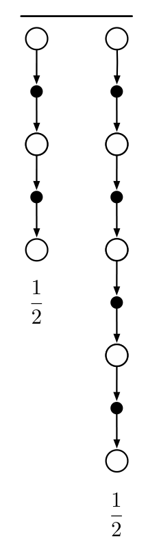
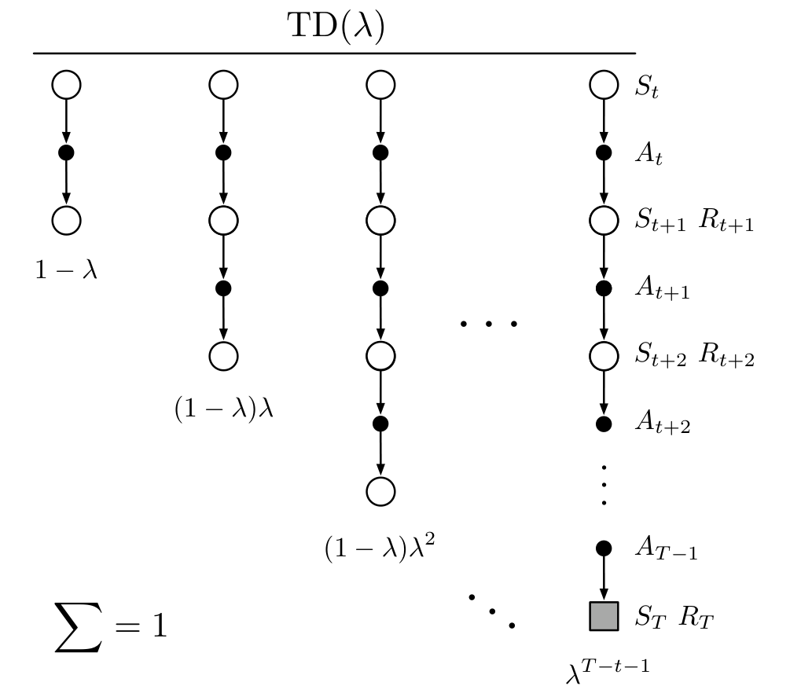

例如，本节开头提到的复合更新，把两步回报和四步回报各取一半，其备份图如右所示：

**图内文字译注：**左侧备份路径到两步回报为止，右侧备份路径到四步回报为止；两条路径下方各标 \(1/2\)，表示两者在复合更新中各占一半。

复合更新只能在最长的分量更新完成后进行。例如，右图中的更新要到 \(t+4\) 时，才能用于时间 \(t\) 形成的估计。通常，我们希望限制最长分量更新的长度，以免更新过度延迟。

TD(\(\lambda\)) 算法可以理解为对 \(n\) 步更新求平均的一种特定方式。这个平均包含全部 \(n\) 步更新，每项的权重与 \(\lambda^{n-1}\) 成正比（其中 \(\lambda\in[0,1)\)），并乘以 \(1-\lambda\) 进行归一化，保证权重总和为 1（图 12.1）。得到的更新指向一种称为 *\(\lambda\)-回报* 的目标，其基于状态的定义为

$$
G_t^\lambda\doteq
(1-\lambda)\sum_{n=1}^{\infty}
\lambda^{n-1}G_{t:t+n}.
\tag{12.2}
$$

图 12.2 进一步说明了 \(\lambda\)-回报中各个 \(n\) 步回报的权重。一步回报的权重最大，为 \(1-\lambda\)；两步回报次之，为 \((1-\lambda)\lambda\)；三步回报的权重为 \((1-\lambda)\lambda^2\)，依此类推。每增加一步，权重就按因子 \(\lambda\) 衰减。到达终止状态之后，后续所有 \(n\) 步回报都等于常规回报 \(G_t\)。

**图 12.1**　TD(\(\lambda\)) 的备份图。如果 \(\lambda=0\)，整个更新只剩第一个分量，即一步 TD 更新；如果 \(\lambda=1\)，则只剩最后一个分量，即蒙特卡洛更新。

**图内文字译注：**顶部 TD(\(\lambda\)) 为算法名；每列是一个分量备份，底部的 \(1-\lambda\)、\((1-\lambda)\lambda\)、\((1-\lambda)\lambda^2\) 与 \(\lambda^{T-t-1}\) 是相应权重，左下角的 \(\sum=1\) 表示权重总和为 1；右侧 \(S_t,A_t,S_{t+1},R_{t+1},\ldots,S_T,R_T\) 标示从当前状态到终止状态的序列，灰色方块表示终止状态。
