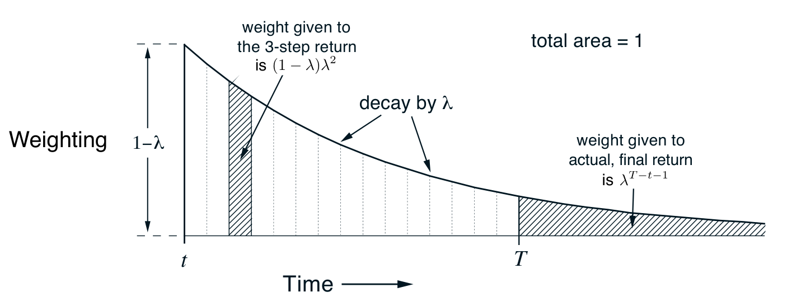

**图 12.2**　\(\lambda\)-回报赋予各个 \(n\) 步回报的权重。

**图内文字译注：**Weighting：权重；Time：时间；\(t\) 为当前时刻，\(T\) 为终止时刻；图左的 \(1-\lambda\) 是初始权重；decay by \(\lambda\)：每步按因子 \(\lambda\) 衰减；weight given to the 3-step return is \((1-\lambda)\lambda^2\)：三步回报的权重为 \((1-\lambda)\lambda^2\)；weight given to actual, final return is \(\lambda^{T-t-1}\)：实际最终回报的权重为 \(\lambda^{T-t-1}\)；total area = 1：权重总和为 1。

如果需要，可以把终止之后的这些项从主求和中分离，得到

$$
G_t^\lambda=
(1-\lambda)\sum_{n=1}^{T-t-1}
\lambda^{n-1}G_{t:t+n}
+\lambda^{T-t-1}G_t.
\tag{12.3}
$$

这正是图中所示的分配方式。该式更清楚地表明 \(\lambda=1\) 时会发生什么：主求和项变为零，剩余一项就是常规回报。因此，\(\lambda=1\) 时，按 \(\lambda\)-回报更新就是蒙特卡洛算法。另一方面，若 \(\lambda=0\)，\(\lambda\)-回报就变成一步回报 \(G_{t:t+1}\)，按它更新就是一步 TD 方法。

**习题 12.1**　回报可以用第一个奖励与一步之后的回报递归地表示（式（3.9））；\(\lambda\)-回报也可以。请由式（12.2）和式（12.1）推导对应的递归关系。 □

**习题 12.2**　参数 \(\lambda\) 描述图 12.2 中的指数权重衰减得有多快，因此也描述 \(\lambda\)-回报算法在确定更新时向未来看多远。不过，用 \(\lambda\) 这样的衰减比率表征衰减速度，有时并不方便。在某些情形下，用时间常数或半衰期更合适。设 \(\tau_\lambda\) 为权重序列降到初值一半所需的时间。请写出 \(\lambda\) 与 \(\tau_\lambda\) 的关系式。 □

现在可以定义第一个基于 \(\lambda\)-回报的学习算法：*离线 \(\lambda\)-回报算法*。它在回合期间不修改权重向量；回合结束时，才以 \(\lambda\)-回报为目标，按通常的半梯度规则依次作一系列离线更新：

$$
\mathbf w_{t+1}\doteq\mathbf w_t+
\alpha\bigl[G_t^\lambda-\hat v(S_t,\mathbf w_t)\bigr]
\nabla\hat v(S_t,\mathbf w_t),
\qquad t=0,\ldots,T-1.
\tag{12.4}
$$
