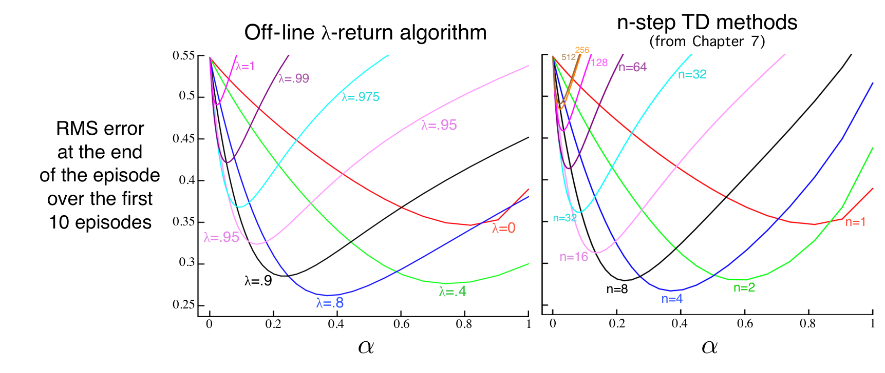

\(\lambda\)-回报提供了另一种在蒙特卡洛与一步 TD 方法之间平滑过渡的方式，可与第 7 章发展的 \(n\) 步自举方式比较。第 7 章曾用一个 19 状态随机游走任务评估方法效果（示例 7.1，第 144 页）。图 12.3 同时给出了离线 \(\lambda\)-回报算法在该任务上的表现，以及第 7 章的 \(n\) 步方法结果（复制自图 7.2）。实验设置与此前相同，只是对 \(\lambda\)-回报算法改变 \(\lambda\)，而非改变 \(n\)。表现指标是：每个回合结束时，19 个状态的正确价值与估计价值之间的估计均方根误差，再对前 10 个回合和 19 个状态取平均。可以看到，离线 \(\lambda\)-回报算法的总体表现与 \(n\) 步算法相当；两者都在自举参数取中间值时表现最好，分别是 \(n\) 步方法的 \(n\) 与离线 \(\lambda\)-回报算法的 \(\lambda\)。

**图 12.3**　19 状态随机游走结果（示例 7.1）：离线 \(\lambda\)-回报算法与 \(n\) 步 TD 方法的表现。在两种方法中，自举参数（\(\lambda\) 或 \(n\)）取中间值时表现最好。离线 \(\lambda\)-回报算法在最佳的 \(\alpha,\lambda\) 值处，以及较大的 \(\alpha\) 下，结果略好。

**图内文字译注：**左图 Off-line \(\lambda\)-return algorithm：离线 \(\lambda\)-回报算法；右图 \(n\)-step TD methods (from Chapter 7)：\(n\) 步 TD 方法（来自第 7 章）；RMS error at the end of the episode over the first 10 episodes：前 10 个回合结束时的均方根误差；横轴 \(\alpha\)：步长。左图曲线标注的 \(\lambda\) 包括 \(0,0.4,0.8,0.9,0.95,0.975,0.99,1\)；右图曲线标注的 \(n\) 包括 \(1,2,4,8,16,32,64,128,256,512\)。数值刻度与曲线颜色均按原图保留。

迄今采用的办法，就是学习算法的理论视角，也称*前向视角*。对访问过的每个状态，我们向前看全部未来奖励，决定怎样最好地组合它们。可以想象自己沿着状态序列前行，从每个状态向前望去，以决定如何更新它，如图 12.4 所示。看过并更新一个状态后，我们移到下一个状态，再也不必处理前一个状态。相反，每个未来状态都会从它之前各个状态的视点，被反复观察和处理。
