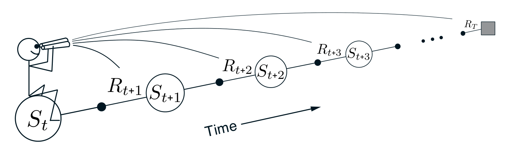

**图 12.4**　前向视角。我们向前看未来的奖励和状态，以决定如何更新每个状态。

**图内文字译注：**Time：时间；从 \(S_t\) 向右，依次是 \(R_{t+1},S_{t+1},R_{t+2},S_{t+2},R_{t+3},S_{t+3},\ldots,R_T\)；望远镜和向前延伸的视线表示从当前状态观察未来。

## 12.2　TD(\(\lambda\))

TD(\(\lambda\)) 是强化学习中最古老、使用最广泛的算法之一。它是第一个被正式证明：使用资格迹、计算上更方便的后向视角，与更偏理论的前向视角之间存在关系的算法。本节将用经验结果表明，它近似于上一节介绍的离线 \(\lambda\)-回报算法。

TD(\(\lambda\)) 在三个方面改进了离线 \(\lambda\)-回报算法。第一，它在回合的每一步更新权重向量，而不是只在结束时更新，因此估计值可能更早改善。第二，计算在时间上均匀分布，而非全部集中在回合结束时。第三，它不仅可用于回合式问题，也可用于持续式问题。本节介绍使用函数近似的半梯度 TD(\(\lambda\))。

采用函数近似时，资格迹是向量 \(\mathbf z_t\in\mathbb R^d\)，分量数与权重向量 \(\mathbf w_t\) 相同。权重向量是长期记忆，贯穿系统整个运行过程不断累积；资格迹是短期记忆，通常持续不到一个回合。资格迹辅助学习；它唯一的作用是影响权重向量，而权重向量随后决定估计价值。

在 TD(\(\lambda\)) 中，每个回合开始时资格迹向量初始化为零；每一步根据价值梯度增加，再按因子 \(\gamma\lambda\) 衰减：

$$
\begin{aligned}
\mathbf z_{-1}&\doteq\mathbf 0,\\
\mathbf z_t&\doteq\gamma\lambda\mathbf z_{t-1}
+\nabla\hat v(S_t,\mathbf w_t),
\qquad 0\le t\le T.
\end{aligned}
\tag{12.5}
$$

这里，\(\gamma\) 是折扣率；\(\lambda\) 是上一节引入的参数，以下称为*迹衰减参数*。资格迹记录：权重向量的哪些分量曾正向或负向地参与近期状态的估值；“近期”的范围由 \(\gamma\lambda\) 决定。（回想在线性函数近似中，\(\nabla\hat v(S_t,\mathbf w_t)\) 就是特征向量 \(\mathbf x_t\)；此时资格迹向量只是历次输入向量按时间衰减后求和。）资格迹表明，如果发生强化事件，权重向量的每个分量有多大资格接受学习改变。
