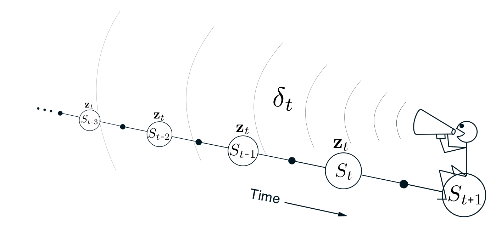

这里所关心的强化事件，是逐时出现的一步 TD 误差。状态价值预测的 TD 误差是

$$
\delta_t\doteq R_{t+1}
+\gamma\hat v(S_{t+1},\mathbf w_t)
-\hat v(S_t,\mathbf w_t).
\tag{12.6}
$$

在 TD(\(\lambda\)) 中，每一步的权重更新与标量 TD 误差和向量资格迹成正比：

$$
\mathbf w_{t+1}\doteq\mathbf w_t+\alpha\delta_t\mathbf z_t.
\tag{12.7}
$$

:::algorithm

### 半梯度 TD(\(\lambda\))：估计 \(\hat v\approx v_\pi\)

输入：待评估的策略 \(\pi\)。

输入：可微函数 \(\hat v:\mathcal S^+\times\mathbb R^d\to\mathbb R\)，满足 \(\hat v(\text{终止状态},\cdot)=0\)。

算法参数：步长 \(\alpha>0\)、迹衰减率 \(\lambda\in[0,1]\)。

任意初始化价值函数权重 \(\mathbf w\)（例如令 \(\mathbf w=\mathbf 0\)）。

对每个回合循环：

　初始化 \(S\)。

　令 \(\mathbf z\leftarrow\mathbf 0\)（一个 \(d\) 维向量）。

　对该回合的每一步循环：

　　选择 \(A\sim\pi(\cdot\mid S)\)。

　　执行行动 \(A\)，观察 \(R,S'\)。

$$
\mathbf z\leftarrow\gamma\lambda\mathbf z
+\nabla\hat v(S,\mathbf w)
$$

$$
\delta\leftarrow R+\gamma\hat v(S',\mathbf w)-\hat v(S,\mathbf w)
$$

$$
\mathbf w\leftarrow\mathbf w+\alpha\delta\mathbf z
$$

　　令 \(S\leftarrow S'\)。

　　直到 \(S'\) 是终止状态。

:::end-algorithm

**图 12.5**　TD(\(\lambda\)) 的后向视角，也称机制视角。每次更新把当前 TD 误差与过去事件的当前资格迹结合起来。

**图内文字译注：**Time：时间；从左向右依次为 \(S_{t-3},S_{t-2},S_{t-1},S_t,S_{t+1}\)；各先前状态上的 \(\mathbf z_t\) 表示当前资格迹对这些状态的贡献；\(\delta_t\) 表示当前 TD 误差，它被传回先前状态。
