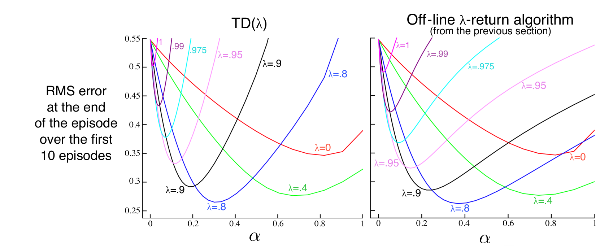

**图 12.6**　19 状态随机游走结果（示例 7.1）：TD(\(\lambda\)) 与离线 \(\lambda\)-回报算法的表现。较低的 \(\alpha\)（低于最佳值）下，两者几乎相同；较高的 \(\alpha\) 下，TD(\(\lambda\)) 更差。

**图内文字译注：**左图 TD(\(\lambda\))；右图 Off-line \(\lambda\)-return algorithm (from the previous section)：离线 \(\lambda\)-回报算法（来自上一节）；RMS error at the end of the episode over the first 10 episodes：前 10 个回合结束时的均方根误差；横轴 \(\alpha\)：步长。两图的曲线均以 \(\lambda\) 标注，包含 \(0,0.4,0.8,0.9,0.95,0.975,0.99,1\)；数值刻度和颜色按原图保留。

已经证明，在线性 TD(\(\lambda\)) 的同策略情形下，若步长参数依照常规条件（式（2.7））随时间递减，算法就会收敛。如 9.4 节所讨论的，收敛目标并非最小误差的权重向量，而是一个取决于 \(\lambda\) 的邻近权重向量。该节给出的解质量界（式（9.14））现在可以推广到任意 \(\lambda\)。对带折扣的持续式任务，有

$$
\overline{\mathrm{VE}}(\mathbf w_\infty)
\le\frac{1-\gamma\lambda}{1-\gamma}
\min_{\mathbf w}\overline{\mathrm{VE}}(\mathbf w).
\tag{12.8}
$$

也就是说，渐近误差最多是最小可能误差的 \((1-\gamma\lambda)/(1-\gamma)\) 倍。当 \(\lambda\) 接近 1 时，这个界接近最小误差；当 \(\lambda=0\) 时界最宽松。不过在实践中，\(\lambda=1\) 往往是最差的选择之一，后面的图 12.14 将说明这一点。

**习题 12.3**　离线 \(\lambda\)-回报算法的误差项（式（12.4）的方括号内）可以在固定权重向量 \(\mathbf w\) 的条件下写成 TD 误差（式（12.6））之和。这有助于理解 TD(\(\lambda\)) 为什么能很好地近似离线 \(\lambda\)-回报算法。请参照式（6.6）的形式，并利用你在习题 12.1 中得到的 \(\lambda\)-回报递归关系，证明这一点。 □

**习题 12.4**　利用上一题的结果证明：如果一个回合中每一步都计算权重更新，却并不实际用它修改权重（\(\mathbf w\) 保持固定），那么 TD(\(\lambda\)) 权重更新之和与离线 \(\lambda\)-回报算法的更新之和相同。 □

## 12.3　\(n\) 步截断 \(\lambda\)-回报方法

离线 \(\lambda\)-回报算法是一个重要的理想形式，但其实用性有限，因为它采用的 \(\lambda\)-回报（式（12.2））要到回合结束后才能知道。在持续式情形中，\(\lambda\)-回报严格来说永远无法完全知道，因为它依赖任意大的 \(n\) 所对应的 \(n\) 步回报，因此也依赖任意遥远未来的奖励。
