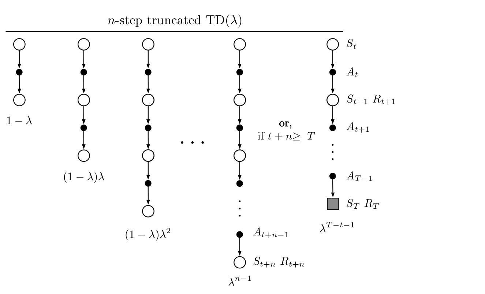

不过，等待越久的奖励，对结果的影响越弱；每多等待一步，就按因子 \(\gamma\lambda\) 衰减。因此，自然的近似方法是在若干步后截断回报序列。已有的 \(n\) 步回报概念提供了自然的实现方式：把尚未得到的奖励换成估计价值。

一般地，如果只掌握到某个较晚时域 \(h\) 的数据，那么时刻 \(t\) 的*截断 \(\lambda\)-回报*定义为

$$
G_{t:h}^\lambda\doteq
(1-\lambda)\sum_{n=1}^{h-t-1}\lambda^{n-1}G_{t:t+n}
+\lambda^{h-t-1}G_{t:h},
\qquad 0\le t<h\le T.
\tag{12.9}
$$

把它与式（12.3）的 \(\lambda\)-回报比较，就会发现时域 \(h\) 扮演了先前终止时间 \(T\) 的角色。在 \(\lambda\)-回报中，剩余权重赋予常规回报 \(G_t\)；这里则赋予现有的最长 \(n\) 步回报 \(G_{t:h}\)（图 12.2）。

截断 \(\lambda\)-回报直接产生一类 \(n\) 步 \(\lambda\)-回报算法，与第 7 章的 \(n\) 步方法类似。所有这些算法都延迟 \(n\) 步更新，只考虑前 \(n\) 个奖励；但现在纳入 \(1\le k\le n\) 的全部 \(k\) 步回报（以前的 \(n\) 步算法只用 \(n\) 步回报），并像图 12.2 那样以几何级数加权。在状态价值情形中，这类算法称为*截断 TD(\(\lambda\))*，记作 TTD(\(\lambda\))。图 12.7 的复合备份图与 TD(\(\lambda\)) 的备份图（图 12.1）相似；区别是最长分量更新至多覆盖 \(n\) 步，而非总要延伸到回合终点。

**图 12.7**　截断 TD(\(\lambda\)) 的备份图。

**图内文字译注：**顶部 \(n\)-step truncated TD(\(\lambda\))：\(n\) 步截断 TD(\(\lambda\))；各分量下方的 \(1-\lambda\)、\((1-\lambda)\lambda\)、\((1-\lambda)\lambda^2\) 是一步、两步、三步回报的权重；最长可用的 \(n\) 步回报权重为 \(\lambda^{n-1}\)；图中 or, if \(t+n\ge T\)：或者，当 \(t+n\ge T\) 时，最后一项取到终止状态，其权重为 \(\lambda^{T-t-1}\)。右侧 \(S_t,A_t,\ldots,S_{t+n},R_{t+n}\) 或 \(S_T,R_T\) 表示相应的状态、行动和奖励；灰色方块是终止状态。
