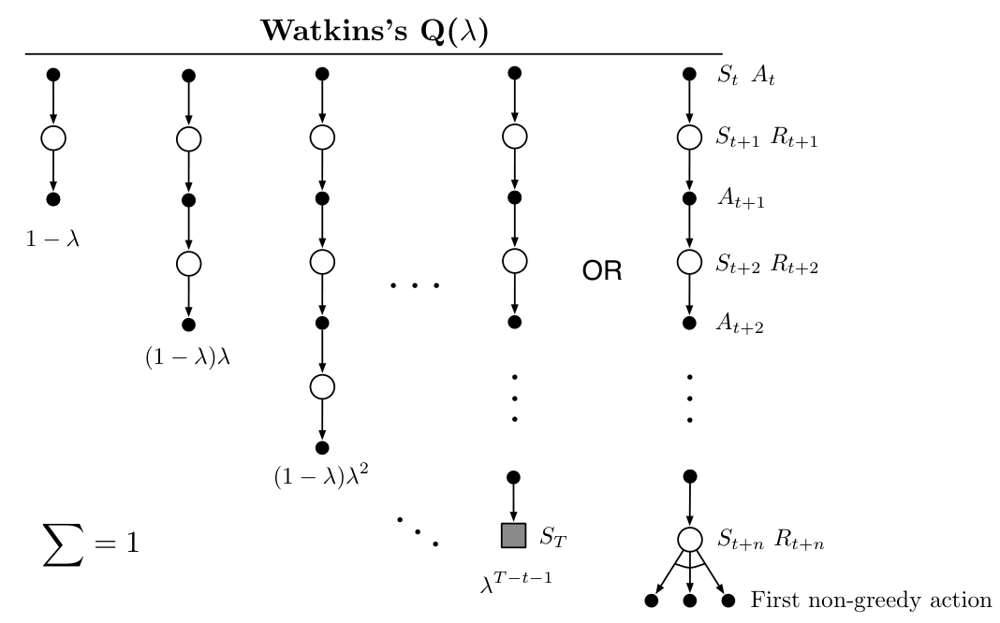

**图 12.12：**Watkins 的 Q(\(\lambda\)) 的备份图。组成更新的序列在回合结束或第一次采取非贪心行动时终止，以先发生者为准。图内文字译注：标题“Watkins’s Q(\(\lambda\))”为“Watkins 的 Q(\(\lambda\))”；“OR”为“或者”；“First non-greedy action”为“第一次非贪心行动”。上方从 \(S_t,A_t\) 开始，白圈标状态与奖励，黑点标行动，灰色方块标终止状态；各段权重依次为 \(1-\lambda\)、\((1-\lambda)\lambda\)、\((1-\lambda)\lambda^2\)、……，最后一支为 \(\lambda^{T-t-1}\) 或 \(\lambda^{n-1}\)，权重总和为 \(1\)。

TB(\(\lambda\)) 的概念很直接。如图 12.13 的备份图所示，把 §7.5 中各种长度的树备份更新，按通常方式依照自举参数 \(\lambda\) 加权。为了在一般自举参数和折扣参数上得到下标正确的详细方程，最好从基于动作价值的 \(\lambda\)-回报递归式（12.20）出发，再仿照式（7.16）展开目标的自举部分：

\[
\begin{aligned}
G_t^{\lambda a}\doteq{}&R_{t+1}+\gamma_{t+1}\Bigl((1-\lambda_{t+1})\bar V_t(S_{t+1})\\
&\quad+\lambda_{t+1}\Bigl[\sum_{a\ne A_{t+1}}\pi(a\mid S_{t+1})\hat q(S_{t+1},a,\mathbf w_t)
+\pi(A_{t+1}\mid S_{t+1})G_{t+1}^{\lambda a}\Bigr]\Bigr)\\
={}&R_{t+1}+\gamma_{t+1}\Bigl(\bar V_t(S_{t+1})
+\lambda_{t+1}\pi(A_{t+1}\mid S_{t+1})\bigl[G_{t+1}^{\lambda a}-\hat q(S_{t+1},A_{t+1},\mathbf w_t)\bigr]\Bigr).
\end{aligned}
\]

按通常的模式，忽略近似价值函数的变化，也可以把它近似写成 TD 误差之和：

\[
G_t^{\lambda a}\approx\hat q(S_t,A_t,\mathbf w_t)
+\sum_{k=t}^{\infty}\delta_k^a\prod_{i=t+1}^{k}\gamma_i\lambda_i\pi(A_i\mid S_i),
\]

其中使用基于行动的 TD 误差的期望形式（12.28）。

按照上一节的相同步骤，就得到一种特殊的资格迹更新，其中包含所选行动在目标策略下的概率：

\[
\mathbf z_t\doteq\gamma_t\lambda_t\pi(A_t\mid S_t)\mathbf z_{t-1}+\nabla\hat q(S_t,A_t,\mathbf w_t).
\]
