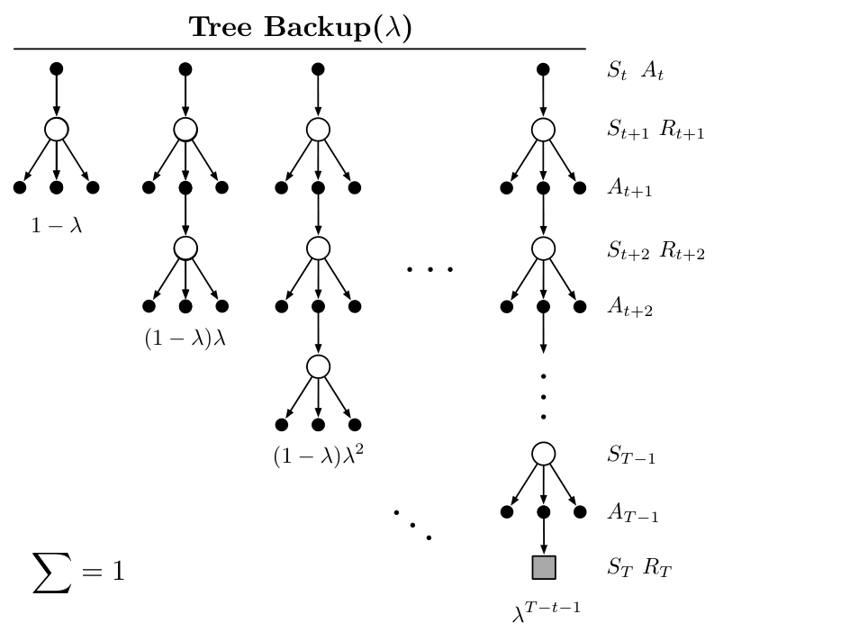

**图 12.13：**树备份算法的 \(\lambda\) 版本的备份图。图内文字译注：标题“Tree Backup(\(\lambda\))”为“树备份(\(\lambda\))”；从 \(S_t,A_t\) 开始，白圈标状态与奖励，黑点标可选行动，向不同黑点分叉表示对目标策略下各行动作期望，灰色方块标终止状态。各长度的权重依次为 \(1-\lambda\)、\((1-\lambda)\lambda\)、\((1-\lambda)\lambda^2\)、……，最后一支为 \(\lambda^{T-t-1}\)；图中标明权重总和为 \(1\)。

这一资格迹配合通常的参数更新规则（12.7），就定义了 TB(\(\lambda\)) 算法。像所有半梯度算法一样，TB(\(\lambda\)) 在异策略数据和强大的函数近似下不保证稳定。要获得这些保证，必须把 TB(\(\lambda\)) 与下一节介绍的某种方法结合。

**∗习题 12.14** 如何把双重预期 Sarsa 扩展到资格迹？ □

## 12.11 带资格迹的稳定异策略方法

已有多种带资格迹的方法被提出，能够保证在异策略训练下稳定。本节选取其中最重要的四种，用本书的标准记号介绍，包括一般自举函数和折扣函数。它们都基于 §11.7 的梯度 TD 思路或 §11.8 的强调 TD 思路。所有算法都假设使用线性函数近似，尽管文献中也有面向非线性函数近似的扩展。

**GTD(\(\lambda\))** 是带资格迹的算法，对应于 TDC——§11.7 讨论的两种状态价值梯度 TD 预测算法中较好的一种。它的目标是学到参数 \(\mathbf w_t\)，使 \(\hat v(s,\mathbf w)\doteq\mathbf w^\top\mathbf x(s)\approx v_\pi(s)\)，即使数据由另一个策略 \(b\) 产生也一样。其更新式为

\[
\mathbf w_{t+1}\doteq\mathbf w_t+\alpha\delta_t^s\mathbf z_t
-\alpha\gamma_{t+1}(1-\lambda_{t+1})(\mathbf z_t^\top\mathbf v_t)\mathbf x_{t+1},
\]
