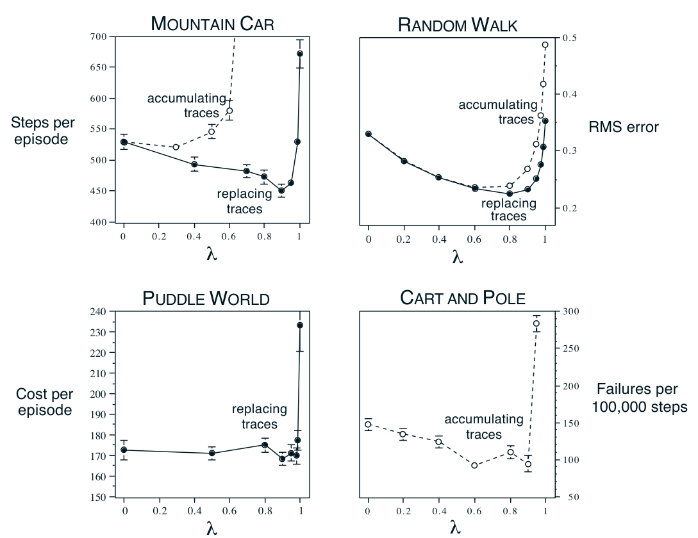

**图 12.14：**\(\lambda\) 对四种不同测试问题中强化学习表现的影响。在所有情形中，\(\lambda\) 取中间值时，表现通常最好（图上的数值越低越好）。左边两幅图是简单的连续状态控制任务，使用 Sarsa(\(\lambda\)) 算法和瓦片编码，并分别采用替换迹或累积迹（Sutton，1996）。右上图是在随机游走任务上用 TD(\(\lambda\)) 做策略评估（Singh 和 Sutton，1996）。右下图是较早研究中的杆平衡任务（示例 3.4）的未发表数据（Sutton，1984）。图内文字译注：四幅图标题“MOUNTAIN CAR”“RANDOM WALK”“PUDDLE WORLD”“CART AND POLE”分别为“山地车”“随机游走”“水洼世界”“小车与杆”；横轴均为 \(\lambda\)。“Steps per episode”为“每回合步数”，“RMS error”为“均方根误差”，“Cost per episode”为“每回合成本”，“Failures per 100,000 steps”为“每 100,000 步失败次数”。“accumulating traces”是“累积迹”，“replacing traces”是“替换迹”；空心标记和虚线对应累积迹，实心标记和实线对应替换迹。原图的坐标刻度和误差线均保留。
