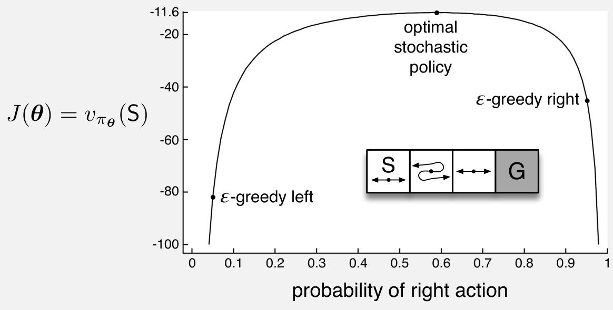

按行动偏好做 softmax 来参数化策略，还有一个优势：它允许以任意概率选择行动。在需要大量函数近似的问题中，最佳近似策略可能是随机的。例如，在信息不完全的纸牌游戏中，最优玩法往往要求以特定概率分别采取两种行动，扑克中的诈唬就是一例。行动价值方法没有自然的途径找出随机最优策略，而策略近似方法可以做到，如例 13.1 所示。

:::source-box

### 例 13.1　行动效果发生对调的短走廊

考虑下图中嵌入的短走廊网格世界。与往常一样，每走一步的奖励为 \(-1\)。三个非终止状态都只有两个行动：向右与向左。在第一个和第三个状态，这两个行动有通常的效果（在第一个状态，向左不会移动）；但在第二个状态，行动效果对调，因此向右会向左移动，向左会向右移动。这个问题之所以困难，是因为在函数近似下，所有状态看起来都一样。具体地，对所有 \(s\)，定义 \(\mathbf x(s,\text{向右})=[1,0]^\top\)，\(\mathbf x(s,\text{向左})=[0,1]^\top\)。使用 \(\varepsilon\)-贪心行动选择的行动价值方法只能在两种策略之间取舍：所有时间步都以高概率 \(1-\varepsilon/2\) 选择向右，或所有时间步都以同样高的概率选择向左。如果 \(\varepsilon=0.1\)，这两种策略在起始状态的价值分别低于 \(-44\) 和 \(-82\)，如图所示。若方法能学到选择向右的某个特定概率，就能好得多。最佳概率约为 \(0.59\)，对应的价值约为 \(-11.6\)。

**图内文字译注：**纵轴 \(J(\boldsymbol\theta)=v_{\pi_{\boldsymbol\theta}}(S)\)，表示起始状态 \(S\) 的价值；横轴为“选择向右行动的概率”。曲线顶点为“最优随机策略”；两侧标点分别为“\(\varepsilon\)-贪心向左”和“\(\varepsilon\)-贪心向右”。走廊示意图的 \(S\) 为起点，\(G\) 为目标；中间第二格的左右行动效果与其余格相反。

:::end-source-box
