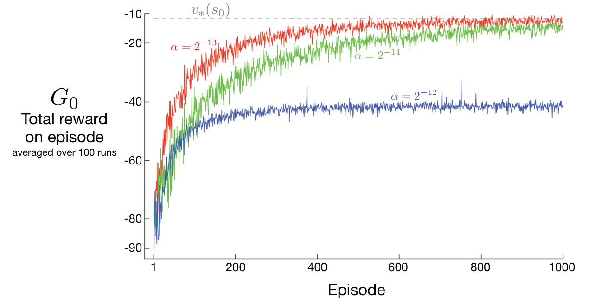

:::algorithm

### REINFORCE：用于求 \(\pi_*\) 的蒙特卡洛策略梯度控制（回合式）

**输入：**可微的策略参数化形式 \(\pi(a\mid s,\boldsymbol\theta)\)。

**算法参数：**步长 \(\alpha>0\)。

**初始化：**策略参数 \(\boldsymbol\theta\in\mathbb R^{d'}\)（例如初始化为 0）。

不断重复（对每个回合）：

　遵循 \(\pi(\cdot\mid\cdot,\boldsymbol\theta)\)，生成一个回合 \(S_0,A_0,R_1,\ldots,S_{T-1},A_{T-1},R_T\)。

　对回合中的每一步 \(t=0,1,\ldots,T-1\)：

　　\(G\leftarrow\sum_{k=t+1}^{T}\gamma^{k-t-1}R_k\)（即 \(G_t\)）。

　　\(\boldsymbol\theta\leftarrow\boldsymbol\theta+\alpha\gamma^t G\nabla\ln\pi(A_t\mid S_t,\boldsymbol\theta)\)。

:::end-algorithm

伪代码更新与 REINFORCE 更新式（13.8）的第二个区别是：前者包含因子 \(\gamma^t\)。这是因为，如前所述，正文处理的是不折扣情形（\(\gamma=1\)），而方框算法给出适用于一般折扣情形的形式。经过适当调整（包括调整第 199 页的方框），折扣情形下所有思想仍成立，但会带来分散对主要思想注意力的额外复杂性。

**∗习题 13.2**　推广第 199 页的方框、策略梯度定理（13.5）、第 325 页对策略梯度定理的证明，以及导出 REINFORCE 更新式（13.8）的步骤，使式（13.8）最终带有 \(\gamma^t\) 因子，从而与伪代码给出的一般算法一致。□

图 13.1 展示了 REINFORCE 在例 13.1 的短走廊网格世界上的表现。

**图内文字译注：**横轴“回合”（Episode）；纵轴 \(G_0\) 为“每回合总奖励”，曲线是 100 次运行的平均结果。三条曲线的步长分别为红色 \(\alpha=2^{-13}\)、绿色 \(\alpha=2^{-14}\)、蓝色 \(\alpha=2^{-12}\)；灰色虚线 \(v_*(s_0)\) 表示起始状态的最优价值。

**图 13.1：**短走廊网格世界（例 13.1）上的 REINFORCE。选用合适的步长时，每回合总奖励会趋近起始状态的最优价值。
