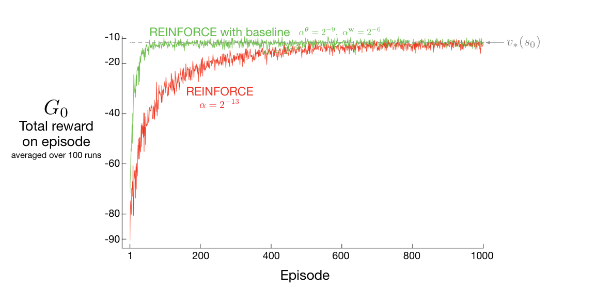

由于 REINFORCE 是用蒙特卡洛方法学习策略参数 \(\boldsymbol\theta\)，自然也可以用蒙特卡洛方法学习状态价值权重 \(\mathbf w\)。下面的方框给出了完整的“带基线的 REINFORCE”伪代码，其中基线是这样学得的状态价值函数。

:::algorithm

### 带基线的 REINFORCE（回合式）：估计 \(\pi_{\boldsymbol\theta}\approx\pi_*\)

输入：可微的策略参数化 \(\pi(a\mid s,\boldsymbol\theta)\)。

输入：可微的状态价值函数参数化 \(\hat v(s,\mathbf w)\)。

算法参数：步长 \(\alpha^\theta>0\)、\(\alpha^w>0\)。

初始化策略参数 \(\boldsymbol\theta\in\mathbb R^{d'}\) 和状态价值权重 \(\mathbf w\in\mathbb R^d\)（例如都设为 \(0\)）。

无限循环（每个回合一次）：

　按 \(\pi(\cdot\mid\cdot,\boldsymbol\theta)\) 生成一个回合 \(S_0,A_0,R_1,\ldots,S_{T-1},A_{T-1},R_T\)。

　对该回合的每一步 \(t=0,1,\ldots,T-1\) 循环：

$$
G\leftarrow\sum_{k=t+1}^{T}\gamma^{k-t-1}R_k\qquad(G_t)
$$

$$
\delta\leftarrow G-\hat v(S_t,\mathbf w)
$$

$$
\mathbf w\leftarrow\mathbf w+\alpha^w\delta\nabla\hat v(S_t,\mathbf w)
$$

$$
\boldsymbol\theta\leftarrow\boldsymbol\theta+\alpha^\theta\gamma^t\delta\nabla\ln\pi(A_t\mid S_t,\boldsymbol\theta)
$$

:::end-algorithm

该算法有两个步长，分别记作 \(\alpha^\theta\) 和 \(\alpha^w\)（其中 \(\alpha^\theta\) 就是式（13.11）中的 \(\alpha\)）。价值函数的步长（此处为 \(\alpha^w\)）比较容易选；在线性情形中，有一些经验规则，例如 \(\alpha^w=0.1/\mathbb E[\lVert\nabla\hat v(S_t,\mathbf w)\rVert_\mu^2]\)（见 §9.6）。策略参数的步长 \(\alpha^\theta\) 该如何选则远不那么明确；其最佳值取决于奖励的变化范围和策略的参数化方式。

**图 13.2：**短走廊网格世界（示例 13.1）表明，给 REINFORCE 加入基线可以使学习快得多。单纯 REINFORCE 采用的步长，是它表现最好的步长（按最接近的 \(2\) 的幂取值；见图 13.1）。图内文字译注：绿色“REINFORCE with baseline”是“带基线的 REINFORCE”，参数 \(\alpha^\theta=2^{-9}\)、\(\alpha^w=2^{-6}\)；红色“REINFORCE”是“REINFORCE”，步长 \(\alpha=2^{-13}\)。横轴“Episode”为“回合数”；纵轴“\(G_0\) Total reward on episode averaged over 100 runs”为“100 次运行的平均每回合总奖励 \(G_0\)”；虚线与箭头 \(v_*(s_0)\) 标出初始状态的最优价值。
