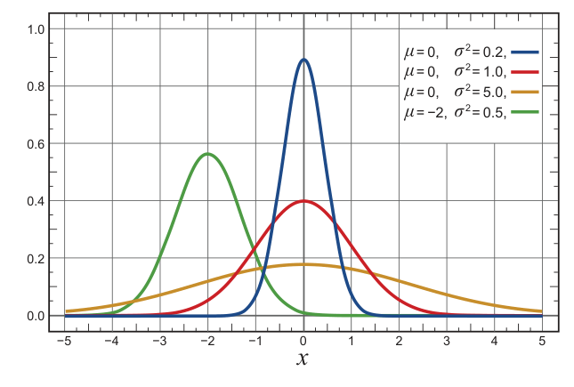

\[
\begin{aligned}
\nabla J(\boldsymbol\theta)
&=\sum_s\mu(s)\sum_a\nabla\pi(a\mid s)q_\pi(s,a)\\
&\quad+\sum_{s'}\underbrace{\Bigl(\sum_s\mu(s)\sum_a\pi(a\mid s)p(s'\mid s,a)\Bigr)}_{\mu(s')\text{，式（13.16）}}\nabla v_\pi(s')-\sum_s\mu(s)\nabla v_\pi(s)\\
&=\sum_s\mu(s)\sum_a\nabla\pi(a\mid s)q_\pi(s,a)+\sum_{s'}\mu(s')\nabla v_\pi(s')-\sum_s\mu(s)\nabla v_\pi(s)\\
&=\sum_s\mu(s)\sum_a\nabla\pi(a\mid s)q_\pi(s,a).\qquad\text{证毕。}
\end{aligned}
\]

:::end-source-box

## 13.7 连续行动的策略参数化

基于策略的方法为处理很大的行动空间提供了实用办法，包括行动数无限的连续空间。与其为大量行动逐一计算学到的概率，不如学习概率分布的统计量。例如，行动集合可以是实数，行动从正态（高斯）分布中选取。

正态分布的概率密度函数通常写为

\[
p(x)\doteq\frac{1}{\sigma\sqrt{2\pi}}\exp\!\left(-\frac{(x-\mu)^2}{2\sigma^2}\right), \tag{13.18}
\]

其中 \(\mu\) 和 \(\sigma\) 分别是正态分布的均值和标准差；这里的 \(\pi\) 当然只是数值约为 \(3.14159\) 的圆周率。右图展示了几组不同均值和标准差对应的概率密度函数。\(p(x)\) 是 \(x\) 处的**概率密度**，不是概率。它可以大于 1；必须等于 1 的是 \(p(x)\) 曲线下的总面积。一般地，对任何一段 \(x\) 的取值范围，把 \(p(x)\) 在该范围积分，就可得到 \(x\) 落在该范围内的概率。

**图内文字译注：**横轴是 \(x\)，纵轴是概率密度。蓝、红、橙、绿四条曲线依次采用 \((\mu,\sigma^2)=(0,0.2),(0,1.0),(0,5.0),(-2,0.5)\)。此图在原书未编号，位于式（13.18）右侧。

为了得到一种策略参数化，可以把策略定义为实数标量行动上的正态概率密度，均值和标准差由依赖状态的参数化函数近似器给出。即

\[
\pi(a\mid s,\boldsymbol\theta)\doteq\frac{1}{\sigma(s,\boldsymbol\theta)\sqrt{2\pi}}\exp\!\left(-\frac{\bigl(a-\mu(s,\boldsymbol\theta)\bigr)^2}{2\sigma(s,\boldsymbol\theta)^2}\right), \tag{13.19}
\]

其中 \(\mu:\mathcal S\times\mathbb R^{d'}\to\mathbb R\) 与 \(\sigma:\mathcal S\times\mathbb R^{d'}\to\mathbb R^+\) 是两个参数化函数近似器。
