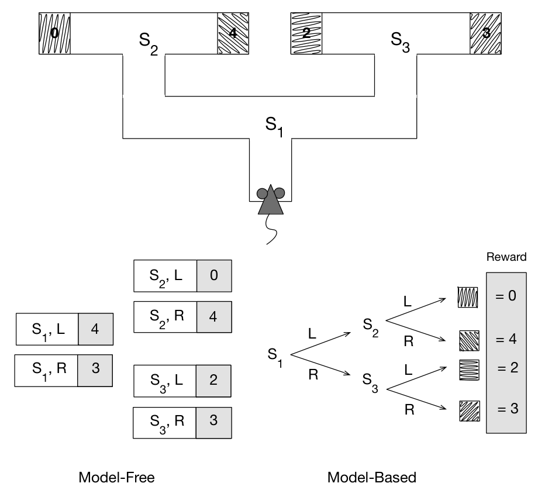

图 14.5 用一个假设性任务说明无模型与基于模型的决策策略有何不同：老鼠必须走过迷宫，到达几种不同的目标箱，每种目标箱提供图中标明数值的奖励。从 \(S_1\) 出发，老鼠先要选择左（L）或右（R），然后在 \(S_2\) 或 \(S_3\) 再选择一次左或右，才能到达目标箱。对老鼠的回合式任务来说，目标箱是每个回合的终止状态。无模型策略（图 14.5 左下）依赖于存储的各状态—行动对的价值。这些行动价值估计了从各个非终止状态采取各行动时，老鼠可预期得到的最高回报；它们是在从起点到终点反复走迷宫的许多试次中得到的。当行动价值足够准确地估计最优回报时，老鼠只需在每个状态选择行动价值最大的行动，便可做出最优决策。在此例中，它会在 \(S_1\) 选择 L，然后在 \(S_2\) 选择 R，得到最大回报 4。另一种无模型策略也可能直接依靠缓存的策略，而不是行动价值：把 \(S_1\) 直接与 L 联系起来，把 \(S_2\) 直接与 R 联系起来。这两种策略做决策时都不依赖环境模型，无须查询状态转移模型，也不必把目标箱的特征与它们提供的奖励联系起来。

**图内文字译注：**“Model-Free”为“无模型”，列出的行动价值是 \(q(S_1,L)=4\)、\(q(S_1,R)=3\)、\(q(S_2,L)=0\)、\(q(S_2,R)=4\)、\(q(S_3,L)=2\)、\(q(S_3,R)=3\)；“Model-Based”为“基于模型”，L／R 分别表示向左／向右，树状图编码从 \(S_1\) 经 \(S_2\) 或 \(S_3\) 到目标箱的状态转移；“Reward”为“奖励”，四种纹理目标箱对应的奖励分别为 0、4、2、3。上方迷宫中的同一纹理表示同一个目标箱。

**图 14.5：**用基于模型与无模型的策略解决假设的顺序行动选择问题。上图：老鼠走过一个有不同目标箱的迷宫，每个目标箱都提供标出的奖励。左下：无模型策略依靠多次学习试次得到的所有状态—行动对的存储行动价值；老鼠在每个状态只需选择行动价值最大的行动。右下：基于模型的策略中，老鼠学习环境模型，包括状态—行动—后继状态的转移知识，以及各目标箱所对应奖励的知识。它可以用模型模拟行动选择序列，寻找回报最高的路径，再决定每个状态如何转弯。改编自 Niv、Joel 和 Dayan，〈A Normative Perspective on Motivation〉，《Trends in Cognitive Science》，第 10 卷第 8 期，第 376 页，2006 年；经 Elsevier 许可。
