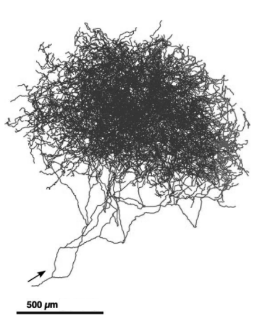

多巴胺神经元特别适合向大脑许多区域广播强化信号。它们的轴突树极大，每个神经元释放多巴胺所到达的突触部位，数量是普通神经元轴突所到达部位的 100 至 1000 倍。右图展示了一只老鼠脑中细胞体位于黑质致密部（SNpc）的单个多巴胺神经元的轴突树。每个 SNpc 或腹侧被盖区（VTA）多巴胺神经元的轴突，在目标脑区神经元的树突上形成约 50 万个突触接触。

图注：以多巴胺为神经递质的单个神经元的轴突树。这些轴突与目标脑区中大量神经元的树突形成突触接触。改编自 Matsuda、Furuta、Nakamura、Hioki、Fujiyama、Arai 和 Kaneko，《The Journal of Neuroscience》，第 29 卷，2009 年，第 451 页。

**图内文字译注：**比例尺为 500 微米（\(500\,\mu\mathrm m\)）；箭头指向轴突的起始方向。

如果多巴胺神经元广播的强化信号类似强化学习中的标量 \(\delta\)，那么，由于这只是一个数，可以预期黑质致密部与腹侧被盖区的所有多巴胺神经元都以大致相同的方式激活，几乎同步地向其轴突所到达的全部位置发送同一信号。人们过去普遍认为多巴胺神经元会如此协同活动；但较新的证据正指向一个更复杂的图景：多巴胺神经元的不同亚群，对输入的反应不同，取决于它们将信号送到哪些结构，以及这些信号以什么不同方式作用于目标结构。多巴胺除了传递 RPE，还具有其他功能；即使对于传递 RPE 的多巴胺神经元，向不同结构传递不同 RPE 也可能合理，因为各结构在产生受强化行为时承担不同作用。本书不深入讨论这一点。不过，从强化学习的角度看，如果决策可分解为若干子决策，用向量值 RPE 信号就有道理；更一般地，这也是解决信用分配问题的结构版本的一种方式：一项决策取得成功或失败时，怎样在可能参与产生它的许多组成结构之间分配功劳或责任？下文 §15.10 还会略谈这个问题。

多数多巴胺神经元的轴突，与额叶皮层和基底神经节中的神经元形成突触接触；这些脑区参与自主运动、决策、学习，以及规划等认知功能。由于把多巴胺与强化学习联系起来的多数观点都聚焦于基底神经节，而且来自多巴胺神经元的连接在那里尤其密集，本节也聚焦于基底神经节。基底神经节是位于前脑底部的一组神经元群，即一组神经核。其主要输入结构称为*纹状体*（striatum）。除其他结构外，几乎整个大脑皮层都向纹状体提供输入。皮层神经元的活动传递着有关感觉输入、内部状态和运动活动的大量信息。皮层神经元的轴突，与纹状体主要输入／输出神经元——*中型多棘神经元*（medium spiny neuron）——的树突形成突触接触。纹状体的输出经过基底神经节的其他神经核和丘脑，回到额叶皮层及运动区，使纹状体能够影响运动、抽象决策过程和奖励处理。纹状体有两个对强化学习重要的主要分区：背侧纹状体主要影响行动选择，腹侧纹状体则被认为对奖励处理的不同方面至关重要，包括为感觉赋予情感价值。
