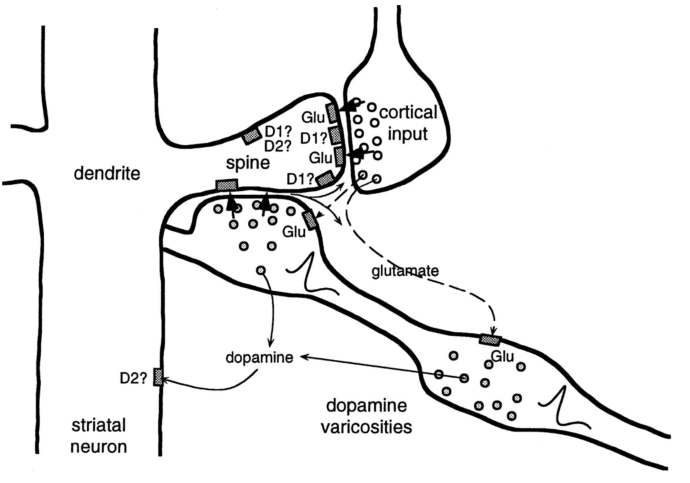

中型多棘神经元的树突布满树突棘，来自皮层神经元的轴突在树突棘顶端形成突触接触。多巴胺神经元的轴突也与这些树突棘形成突触接触，但接触的是树突棘的柄部（图 15.1）。这种排列使皮层神经元的突触前活动、中型多棘神经元的突触后活动，以及多巴胺神经元的输入汇集在一起。树突棘上实际发生的事情十分复杂，目前还没有被完全弄清。图 15.1 示意了其中的复杂性：有两类多巴胺受体、接受皮层输入所释放的神经递质——谷氨酸——的受体，以及不同信号相互作用的多种方式。不过，越来越多的证据表明，从皮层通往纹状体这条通路上的突触——神经科学家称为*皮层—纹状体突触*（corticostriatal synapse）——其效能的改变，关键取决于时间恰当的多巴胺信号。

**图 15.1：**纹状体神经元的树突棘，同时接受皮层神经元和多巴胺神经元的输入。皮层神经元的轴突，在覆盖纹状体神经元树突的树突棘顶端释放神经递质谷氨酸，经皮层—纹状体突触影响纹状体神经元。图中一条来自腹侧被盖区（VTA）或黑质致密部（SNpc）多巴胺神经元的轴突，从右下方经过树突棘。轴突上的“多巴胺膨体”在树突棘柄部或其附近释放多巴胺。这样的排列让来自皮层的突触前输入、纹状体神经元的突触后活动和多巴胺汇集在一起，使多种学习规则都有可能支配皮层—纹状体突触的可塑性。每条多巴胺神经元轴突，都与大约 50 万个树突棘的柄部形成突触接触。我们在讨论中省略的部分复杂性，也可从图中的其他神经递质通路和多种受体类型看出；例如，多巴胺可通过 D1、D2 多巴胺受体，对树突棘及其他突触后部位产生不同作用。引自 W. Schultz，《Journal of Neurophysiology》，第 80 卷，1998 年，第 10 页。

**图内文字译注：**dendrite：树突；spine：树突棘；cortical input：皮层输入；striatal neuron：纹状体神经元；dopamine varicosities：多巴胺膨体；dopamine：多巴胺；glutamate：谷氨酸；Glu：谷氨酸；D1?、D2?：图中标有问号的 D1、D2 受体位置。
