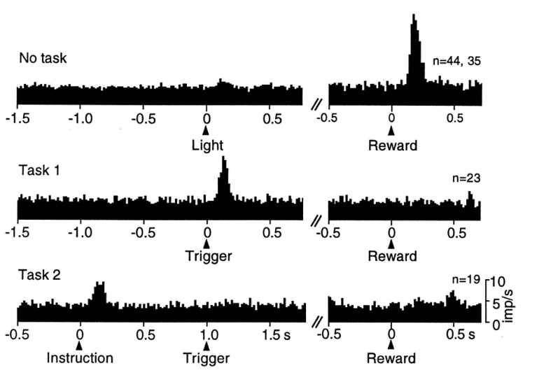

Schultz 的团队随后开展了许多研究，涉及黑质致密部（SNpc）和腹侧被盖区（VTA）的多巴胺神经元。其中一系列实验产生了重要影响：它们提示，多巴胺神经元的时相反应对应 TD 误差，而不是式（14.3）中 Rescorla–Wagner 模型那样更简单的误差。在第一项实验中（Ljungberg、Apicella 和 Schultz，1992），研究者训练猴子在灯作为“触发提示”亮起后按下杠杆，从而得到一滴苹果汁。和 Romo 与 Schultz 先前观察到的一样，许多多巴胺神经元起初对奖励——那滴果汁——作出反应（图 15.2 上部）。但随着训练继续，其中许多神经元不再对奖励作出反应，转而对预测奖励的灯亮起作出反应（图 15.2 中部）。继续训练后，猴子按杠杆的速度变快，而对触发提示作出反应的多巴胺神经元数量减少。

完成这项研究后，研究者又用一个新任务训练同一批猴子（Schultz、Apicella 和 Ljungberg，1993）。猴子面前有两个杠杆，各有一盏灯；其中一盏灯亮起时，便以“指令提示”指明按哪个杠杆可以得到一滴苹果汁。在这个任务中，指令提示比先前任务里的触发提示早出现固定的 1 秒。猴子学会在看见触发提示之前不伸手，而多巴胺神经元的活动增加了；但现在，所监测神经元的反应几乎只发生在更早的指令提示出现时，不再发生在触发提示出现时（图 15.2 下部）。在这里，任务被熟练掌握后，对指令提示作出反应的多巴胺神经元数量同样大幅减少。在这几个任务的学习过程中，多巴胺神经元的活动，从起初对奖励作出反应，转向对更早出现的预测性刺激作出反应：先转移到触发刺激，再转移到更早的指令提示。反应向更早时刻移动时，对较晚刺激的反应便消失。这种向更早的奖励预测信号转移、同时失去对较晚预测信号反应的现象，是 TD 学习的一个标志性特征（例如见图 14.2）。

**图 15.2：**多巴胺神经元的反应，从起初对初级奖励作出反应，转移到对更早的预测性刺激作出反应。图中绘出所监测多巴胺神经元在短时间间隔内产生的动作电位数，并对全部受监测神经元取平均；这些数据涉及 23 至 44 个神经元。上部：意外获得一滴苹果汁时，多巴胺神经元被激活。中部：经过学习，神经元开始对预测奖励的触发提示作出反应，不再对奖励的给予作出反应。下部：在触发提示之前 1 秒加入指令提示后，神经元的反应从触发提示转移到更早的指令提示。引自 Schultz 等（1995），MIT Press。

**图内文字译注：**No task：无任务；Task 1／Task 2：任务 1／任务 2；Light：灯光；Reward：奖励；Trigger：触发提示；Instruction：指令提示；n=44, 35、n=23、n=19：各组数据对应的受监测神经元数量；横轴数字和 s 表示相对于所标事件的秒数，双斜杠表示时间轴中断；纵轴 imp/s 表示每秒脉冲数（动作电位频率）。
