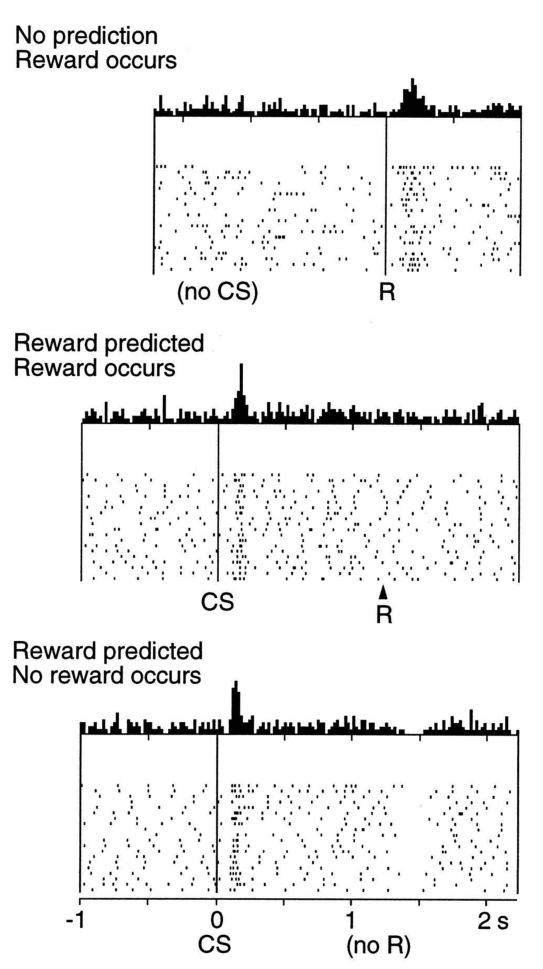

刚才的任务还揭示出多巴胺神经元活动与 TD 学习共有的另一种特性。有时猴子按错了杠杆，即按了与指令所指不同的杠杆，因此得不到奖励。在这些试次中，许多多巴胺神经元在通常应该得到奖励的时间之后不久，放电率急剧降到基线水平以下；即使没有任何外部提示来标记奖励通常到来的时间，也会如此（图 15.3）。看来猴子会在内部追踪奖励到来的时间。（要解释多巴胺神经元反应在时间上的某些细节，就需要修改最简单版本的 TD 学习；下一节会讨论这个问题。）

**图 15.3：**预期的奖励没有出现时，多巴胺神经元的反应会在预期奖励时刻过后不久，降至基线以下。上部：意外给予一滴苹果汁时，多巴胺神经元被激活。中部：多巴胺神经元对预测奖励的条件刺激（CS）作出反应，而不再对奖励本身作出反应。下部：CS 所预测的奖励没有出现时，多巴胺神经元的活动在预期奖励时刻过后不久降至基线以下。每一部分顶部显示所监测神经元在所标时间附近的短时间间隔内产生的平均动作电位数；下方点阵图显示每个受监测神经元的活动模式，每个点代表一个动作电位。引自 Schultz、Dayan 和 Montague，〈A Neural Substrate of Prediction and Reward〉，《Science》，第 275 卷第 5306 期，1997 年 3 月 14 日，第 1593–1598 页；经 AAAS 许可转载。

**图内文字译注：**No prediction / Reward occurs：没有预测／奖励出现；Reward predicted / Reward occurs：预测到奖励／奖励出现；Reward predicted / No reward occurs：预测到奖励／奖励没有出现；no CS：没有条件刺激；CS：条件刺激；R：奖励；no R：无奖励；横轴数字以秒为单位；中、下两部分的 0 对应条件刺激出现的时刻，上部相应位置标为“没有条件刺激”。顶部短竖线为平均放电活动，下方每个点是一个动作电位。
