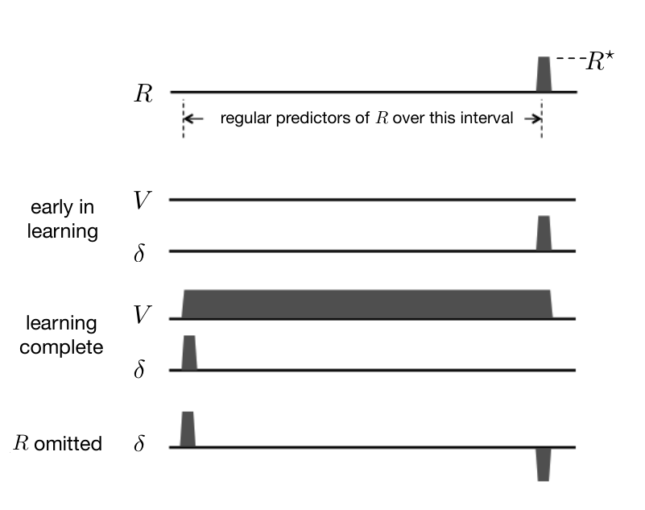

和通常一样，我们还需要假设状态如何表示为学习算法的输入；这一假设会影响 TD 误差与多巴胺神经元活动有多接近。稍后会讨论这个问题。目前，我们采用 Montague 等（1996）所使用的相同完整串行复合刺激（CSC）表征：在一次试次的每个时间步，对所访问的每个状态都使用一个独立的内部刺激。于是，这个过程化为本书第一部分讨论的表格型情形。最后，假设智能体用 TD(0) 学习价值函数 \(V\)：函数保存在查找表中，所有状态的初值均为零。还假设任务是确定性的，折扣因子 \(\gamma\) 非常接近 1，因此可以忽略折扣。

图 15.4 展示了这个策略评估任务在学习的几个阶段中，\(R\)、\(V\) 和 \(\delta\) 随时间的变化。横轴表示一次试次中依次访问一系列状态的时间区间（为了清晰，图中没有逐个画出状态）。在整次试次中，奖励信号一直为零；仅当智能体到达时间轴右端附近的奖励状态时，奖励信号才变为某个正数，例如 \(R^*\)。TD 学习的目标是预测一次试次中所访问每个状态之后的回报。在这个没有折扣、且按我们的假设预测只限于单次试次的情形中，每个状态之后的回报都是 \(R^*\)。

**图 15.4：**TD 学习中 TD 误差 \(\delta\) 的表现，与多巴胺神经元时相激活的特征一致。（这里的 \(\delta\) 指在时刻 \(t\) 可用的 TD 误差，即 \(\delta_{t-1}\)。）上部：一系列状态（图中表现为一段持续预测奖励的区间）之后，出现非零奖励 \(R^*\)。学习初期：价值函数 \(V\) 处于初始状态，初始的 \(\delta\) 等于 \(R^*\)。学习完成：价值函数准确预测未来奖励，\(\delta\) 在最早出现的预测性状态处为正，在非零奖励出现时则为零。省略 \(R^*\)：在预期的奖励未出现时，\(\delta\) 变为负值。下文会完整解释其原因。

**图内文字译注：**R：奖励；regular predictors of R over this interval：这一时间区间内持续出现的奖励预测信号；early in learning：学习初期；learning complete：学习完成；R omitted：奖励被省略；V：价值函数；δ：TD 误差；\(R^*\)：非零奖励 \(R^*\)。图示采用 \(\delta_{t-1}=R_t+V_t-V_{t-1}\)（折扣因子视为 1）。
