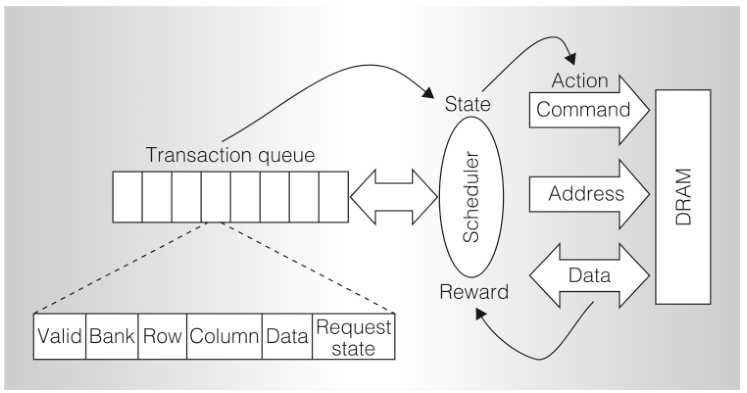

控制器采用的访问请求调度策略，会显著影响内存系统的表现，例如满足请求的平均延迟，以及系统能够达到的吞吐量。最简单的策略按请求到达顺序处理：完成一个请求所需的全部命令后，才开始处理下一请求。但如果系统还没有准备好执行其中一条命令，或者执行这条命令会使资源利用不足（例如处理它所引起的时序约束所致），那么在完成较早请求之前，先开始处理较新的请求就有道理。策略可通过重排请求来提高效率，例如让读请求优先于写请求，或让针对已打开行的读写命令优先。称为“先就绪、先到先服务”（First-Ready, First-Come-First-Serve，FR-FCFS）的策略，让列命令（读和写）优先于行命令（激活和预充电）；优先级相同时，选最早到达的命令。在通常遇到的条件下，FR-FCFS 的平均内存访问延迟优于其他调度策略（Rixner，2004）。

图 16.3 是 İpek 等强化学习内存控制器的概览。他们把 DRAM 访问过程建模为一个 MDP：状态是事务队列的内容，动作是发给 DRAM 系统的命令，即预充电、激活、读、写和空操作（NoOp）。动作是读或写时，奖励信号为 1；否则为 0。状态转移被视为随机过程，因为系统下一状态不仅取决于调度器发出的命令，还取决于调度器无法控制的系统行为，例如访问 DRAM 系统的各处理器核心的工作负载。

**图 16.3：**强化学习 DRAM 控制器的概览。调度器是强化学习智能体；其环境由事务队列的特征表示，其动作是向 DRAM 系统发出的命令。©2009 IEEE。经许可转载自 J. F. Martínez 和 E. İpek，〈Dynamic multicore resource management: A machine learning approach〉，《IEEE Micro》，29(5)，第 12 页。

**图内文字译注：**Transaction queue：事务队列；Valid：有效位；Bank：存储体；Row：行；Column：列；Data：数据；Request state：请求状态；State：状态；Scheduler：调度器；Reward：奖励；Action：动作；Command：命令；Address：地址；DRAM：动态随机存取存储器。
