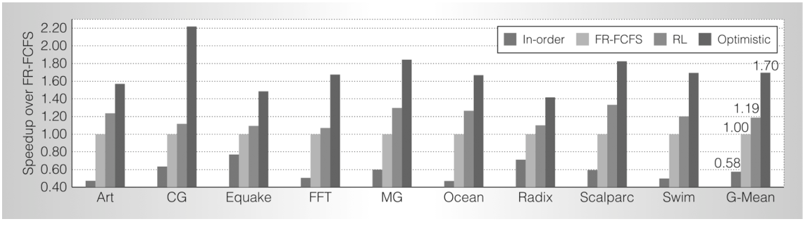

İpek 等通过仿真评估学习控制器，并与另外三种控制器比较：（1）前述平均表现最好的 FR-FCFS 控制器；（2）按顺序处理每个请求的传统控制器；（3）一个无法实际实现的理想控制器，称为 Optimistic。Optimistic 忽略全部时序和资源约束，因此只要有足够的请求，就能维持 100% 的 DRAM 吞吐量；但它仍按行缓冲区命中情况模拟 DRAM 延迟与带宽。研究者模拟了九种内存密集型并行工作负载，涉及科学计算和数据挖掘应用。图 16.4 给出四种控制器在这九个应用中的表现：指标是执行时间的倒数，并以 FR-FCFS 的表现归一化；图中还给出各控制器跨九个应用表现的几何平均值。图中标为 RL 的学习控制器，相比 FR-FCFS，在九个应用中分别提高了 7% 至 33%，平均提高 19%。当然，任何可实现控制器都无法达到忽略所有时序和资源约束的 Optimistic 控制器的表现，但学习控制器仍把它与 Optimistic 上界之间的差距缩小了可观的 27%。

研究者希望把学习算法放在芯片上，是为了让调度策略能够在线适应变化的工作负载；因此，İpek 等分析了在线学习相对预先学得的固定策略的影响。他们用全部九个基准应用的数据训练控制器，然后在模拟执行这些应用的整个过程中，将所得动作价值保持固定。他们发现，在线学习控制器的平均表现，比采用固定策略的控制器高 8%，据此认为在线学习是其方法的重要特征。

**图 16.4：**四种控制器在九个仿真基准应用中的表现。这些控制器分别是：最简单的“按序”控制器、FR-FCFS、学习控制器 RL，以及忽略全部时序和资源约束、提供性能上界但无法实现的 Optimistic 控制器。表现以 FR-FCFS 为基准归一化，用执行时间的倒数衡量。最右侧是四种控制器在九个基准应用中表现的几何平均值。RL 控制器最接近理想表现。©2009 IEEE。经许可转载自 J. F. Martínez 和 E. İpek，〈Dynamic multicore resource management: A machine learning approach〉，《IEEE Micro》，29(5)，第 13 页。

**图内文字译注：**纵轴 Speedup over FR-FCFS：相对 FR-FCFS 的加速比；图例 In-order：按序控制器，FR-FCFS：先就绪、先到先服务，RL：强化学习控制器，Optimistic：理想上界控制器；横轴 Art、CG、Equake、FFT、MG、Ocean、Radix、Scalparc、Swim 为九个基准应用的名称，G-Mean 为几何平均值；最右侧标出的 0.58、1.00、1.19、1.70 分别是四种控制器的几何平均加速比。
